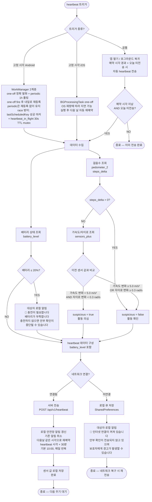
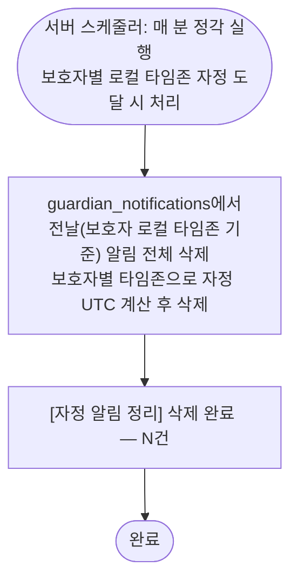
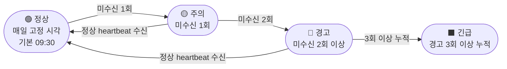
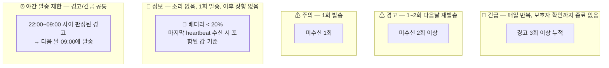
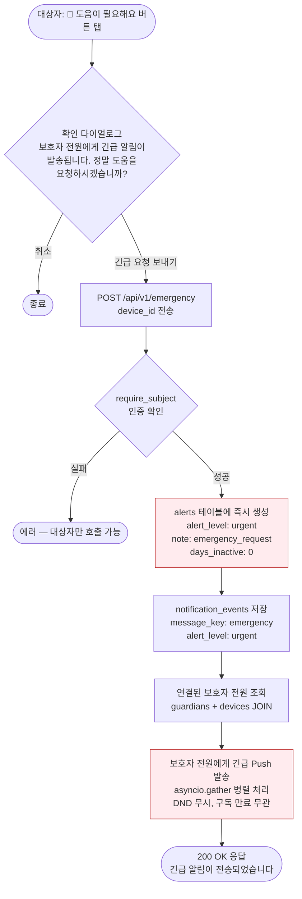
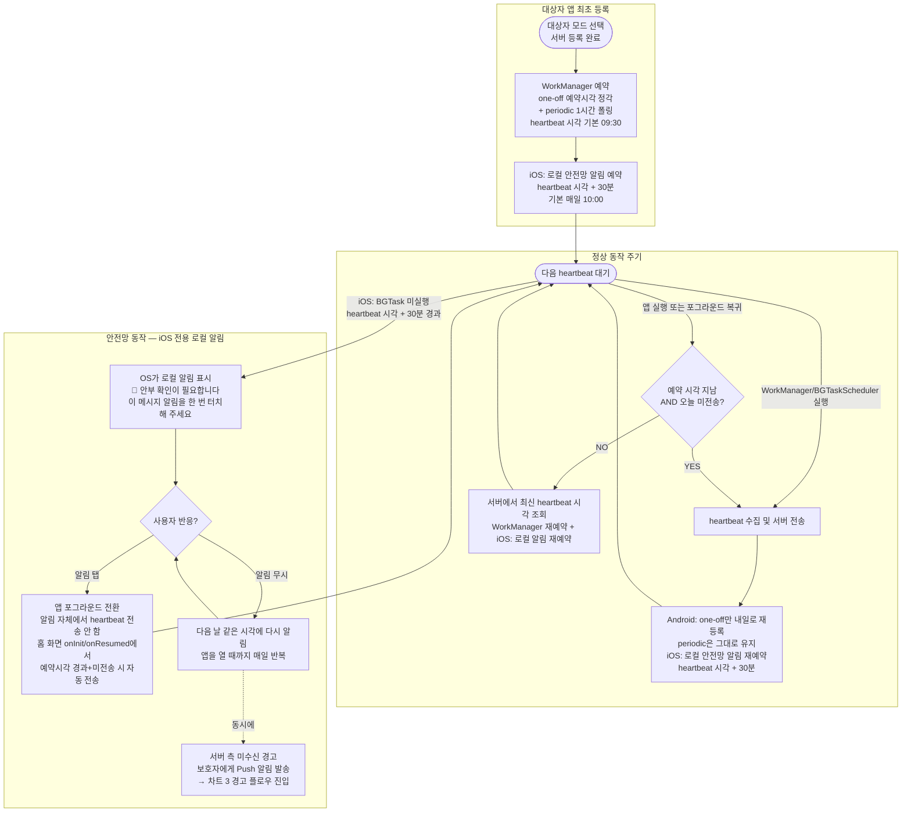

# Heartbeat 감지 및 경고 플로우차트

## 경고 등급 최종 확정 테이블

| 등급 | 조건 | 발송 |
|------|------|------|
| 🚨 긴급 | 경고 3회 이상 누적 | 매일 반복, 보호자 확인까지 종료 없음 |
| 🚨 긴급 | 대상자 긴급 도움 요청 (POST /api/v1/emergency) | 즉시 1회 발송 (에스컬레이션 독립) |
| ⚠ 경고 | 미수신 2회 이상 | 1~2회 다음날 재발송 |
| ⚠ 주의 | 미수신 1회 | 1회 발송 |
| 🔵 정보 | 배터리 < 20% (마지막 heartbeat 기준) | 1회 발송, 이후 상향 없음 |
| ✅ 정보 | 보호자 수동 경고 클리어 (PUT /api/v1/alerts/clear-all) | 클리어한 보호자 제외 다른 보호자에게 1회 발송 |


## 용어 설명

| 용어 | 값 | 의미 |
|------|-----|------|
| `suspicious` | `true` | 센서 변화 없음 — 폰을 아무도 만지지 않은 것으로 의심되는 상태 |
| `suspicious` | `false` | 센서 변화 감지 — 누군가 폰을 사용한 정상 상태 |


## 1. 클라이언트 — Heartbeat 수집 및 전송




## 2. 서버 — Heartbeat 수신 후 판정

```mermaid
flowchart TD
    Receive([서버: heartbeat 수신])
    Receive --> UpdateLastSeen[last_seen 갱신]

    UpdateLastSeen --> TodayCheck{오늘(기기 로컬 타임존) 이미<br/>heartbeat 수신 여부?}
    TodayCheck -->|이미 수신 + suspicious=true| ForceNormal[suspicious 강제 false<br/>하루 첫 heartbeat에서만 판정]
    TodayCheck -->|첫 heartbeat| BattCheck

    ForceNormal --> BattCheck

    BattCheck{battery_level < 20%?}
    BattCheck -->|YES| BattNoti[🔵 정보 등급<br/>보호자 Push 알림 소리 없음<br/>🔋 배터리 부족<br/>충전이 필요합니다]
    BattCheck -->|NO| AlertActive
    BattNoti --> AlertActive

    AlertActive{기존 경고 활성 중?}
    AlertActive -->|YES| SuspiciousFirst{suspicious?}

    SuspiciousFirst -->|false| Resolve[경고 완전 해소<br/>보호자 Push 알림<br/>✅ 대상자의 안부 확인이<br/>정상 복귀되었습니다]
    SuspiciousFirst -->|true| Downgrade[경고 등급 하향<br/>warning / urgent → caution<br/>정상 복귀 알림 없음<br/>폰 신호만 수신, 사용 흔적 없음]

    AlertActive -->|NO| CheckSuspicious{suspicious?}
    Resolve --> StatusNormal([✅ 정상<br/>센서 움직임 감지 — 사용 확인])
    Downgrade --> Wait1

    CheckSuspicious -->|false| StatusNormal
    CheckSuspicious -->|true| Wait1([⏱ suspicious_count 기반 보호자 경고 에스컬레이션<br/>1회 → caution + caution_suspicious<br/>2회 → warning + warning_suspicious<br/>3회+ → urgent + urgent_suspicious<br/>※ scheduler 미수신 경로와 별도 문구 사용])

    StatusNormal --> SaveNoti[보호자 알림 DB 저장<br/>guardian_notifications<br/>alert_level: info<br/>is_push_sent: true/false]
    SaveNoti --> StepsNoti{steps_delta > 0?}
    StepsNoti -->|YES| StepsCompare[활동 정보 알림 DB 저장<br/>🚶 활동 정보<br/>M/D 오전/오후 HH:MM ~ M/D 오전/오후 HH:MM 사이 N보를 걸으셨습니다.<br/>Push 발송 없음]
    StepsNoti -->|NO| End3([완료])
    StepsCompare --> End3
```


## 3. 서버 — Heartbeat 미수신 시 경고 플로우

```mermaid
flowchart TD
    Scheduler([서버 APScheduler: 매 분 정각 실행<br/>CronTrigger(second=0)<br/>heartbeat 시각 + 2시간 경과 시 미수신 체크])
    Scheduler --> FindMissing[해당 시각까지<br/>heartbeat 미수신 대상자 조회]

    FindMissing --> SubActive{보호자<br/>구독 활성?}
    SubActive -->|NO| Skip([알림 미발송<br/>heartbeat는 계속 수신])
    SubActive -->|YES| CheckLastBatt{마지막 heartbeat의<br/>battery_level < 20%?}

    CheckLastBatt -->|YES| BattDead[🔵 정보 등급 판정<br/>배터리 방전 추정]
    BattDead --> BattDeadNoti[보호자 Push 알림 정보 등급 소리 없음<br/>🔋 배터리 방전 추정<br/>충전 후 자동으로 정상 복귀됩니다]
    BattDeadNoti --> BattSave[guardian_notifications DB 저장<br/>alert_level: info, is_push_sent: true]
    BattSave --> BattEnd([1회 발송 후 종료<br/>이후 미수신 지속되어도 상향 없음<br/>heartbeat 수신 시 자동 해소])

    CheckLastBatt -->|NO| MissCount{누적 미수신 횟수?}

    MissCount -->|1회| Caution[⚠ 주의 등급 판정]
    Caution --> CautionNoti[보호자 Push 알림 주의 등급<br/>⚠ 안부 확인<br/>오늘 안부 확인이 없습니다]
    CautionNoti --> CautionSave[guardian_notifications DB 저장<br/>alert_level: caution, is_push_sent: true]
    CautionSave --> NextDay0([다음 날 재확인])

    MissCount -->|2회 이상| Warning[⚠ 경고 등급 판정]
    Warning --> NightCheck1{현재 시각<br/>22:00~09:00?}

    NightCheck1 -->|NO 주간| WarningNoti[보호자 Push 알림 경고 등급<br/>⚠ 안부 확인<br/>안부 확인이 없습니다<br/>통신 불가 상태일 수 있습니다]
    NightCheck1 -->|YES 야간| Delay1([DB에 기록 후<br/>다음 날 09:00에 발송 예약])
    Delay1 --> WarningNoti

    WarningNoti --> WarningSave[guardian_notifications DB 저장<br/>alert_level: warning, is_push_sent: true]
    WarningSave --> WarningRepeat{경고 횟수?}
    WarningRepeat -->|2회 이하| NextDay1([다음 날 같은 시각에 재발송])
    WarningRepeat -->|3회 이상| UpgradeUrgent[🚨 긴급 등급으로 상향]
    UpgradeUrgent --> NightCheck2{현재 시각<br/>22:00~09:00?}

    NightCheck2 -->|NO 주간| UrgentNoti[보호자 Push 알림 긴급 등급<br/>🚨 긴급: 대상자 확인 필요<br/>즉시 확인이 필요합니다]
    NightCheck2 -->|YES 야간| Delay2([DB에 기록 후<br/>다음 날 09:00에 발송 예약])
    Delay2 --> UrgentNoti

    UrgentNoti --> UrgentSave[guardian_notifications DB 저장<br/>alert_level: urgent, is_push_sent: true]
    UrgentSave --> DailyRepeat([매일 같은 시각에 반복<br/>보호자 확인까지 종료 없음])
```


## 4. 보호자 알림 자정 정리 스케줄러



**보호자 알림 조회 흐름:**
```
보호자 앱 실행 또는 알림 목록 화면 진입
    ↓
GET /api/v1/notifications 호출
    ↓
서버: 당일(KST) guardian_notifications 반환 (시간순)
    ↓
클라이언트: is_push_sent = false 항목도 목록에 표시
    ↓
자정 이후 → 서버가 전날 알림 삭제 → 다음 날 00:00부터 새 목록 시작
```


## 5. 적응형 Heartbeat 주기 상태도




## 6. 경고 등급 요약




## 7. 대상자 긴급 도움 요청 플로우

> 대상자가 앱에서 직접 긴급 버튼을 눌러 보호자 전원에게 즉시 urgent 알림을 발송하는 플로우.
> 기존 heartbeat 경고 에스컬레이션(suspicious_count, days_inactive)과 완전히 독립 동작한다.



**긴급 도움 요청의 특성:**

| 항목 | 동작 |
|------|------|
| 경고 등급 | 즉시 urgent (caution→warning→urgent 단계 생략) |
| 기존 카운터 | suspicious_count, days_inactive 변경 없음 |
| DND | 무시 (항상 발송) |
| 구독 상태 | 무관 (만료되어도 발송) |
| 보호자 범위 | 연결된 전원 |
| 반복 발송 | 없음 (1회 즉시 발송) |
| 클라이언트 | 확인 다이얼로그로 오탐 방지 |


## 8. Heartbeat 예약 실행 계층 (WorkManager + 로컬 알림 안전망)

> **1차 (Android)**: WorkManager 2계층으로 등록한다 — (a) **one-off**: 예약시각에 정확히 1회 fire. 전송 성공 후 `rescheduleOneOffForNextDay()`로 내일 예약시각에 재등록. (b) **periodic 1시간**: 안전망 폴링. one-off가 OEM 배터리 절약/Doze 등으로 누락되어도 최대 1시간 내 백업 발화. fire 후 재등록하지 않고 그대로 둔다 — workmanager의 `UPDATE`는 initialDelay를 무시하고 `REPLACE`는 자기자신을 취소하는 이슈가 있어 건드리면 오히려 폴링이 깨진다. one-off와 periodic이 거의 동시에 fire되는 race는 **역할 분리된 2선 방어**로 차단한다: (1) 콜백 진입 시 `lastHeartbeatDate == 오늘` 검사(콜백 레벨 1차 거름), (2) `HeartbeatService._executeInternal`에서 `lastScheduledKey`(성공 마커 — API 전송 성공 후에만 save) + `heartbeat_in_flight`(**30초 TTL mutex lock** — 센서/전송 직전 save, finally에서 clear, TTL 초과 시 crashed isolate 이어받음) 검사. 과거에는 `lastScheduledKey`를 선점 save해 락과 성공 마커를 겸용했으나, Worker가 Doze/OEM 절전으로 중도 종료될 때 선점 마커만 남아 2차 안전망을 영구 차단하는 ghost state 버그가 있어 역할을 분리했다. iOS는 BGTaskScheduler 불안정성 때문에 사용하지 않는다.
> **2차**: 앱 열기/포그라운드 복귀 시 오늘 미전송이면 자동 전송한다. Android에서는 one-off/periodic 모두 실패한 경우의 최종 안전망. 진입 시 `isReportedToday=false`인데 오늘 날짜의 `lastScheduledKey`가 남아 있으면 stale ghost로 판단하고 제거한다(`_clearStaleScheduledKey`, 커밋 4260e53) — Worker가 중도 종료되어 남긴 성공 마커가 2차 안전망을 차단하지 않도록 하는 전환기 방어선으로, SubjectHome과 GuardianSafetyCode 양쪽 진입 시 수행한다.
> **3차 (iOS 전용)**: 로컬 알림 안전망 (heartbeat 시각 + 30분)이 OS에 의해 표시되며, 사용자가 탭하면 앱이 열린다. 알림 자체에서 heartbeat를 전송하지 않고, 홈 화면의 `onInit`/`onResumed`에서 예약시각 경과 + 미전송 시 자동 전송한다. Android는 오늘의 안부 확인 메시지 로컬 알림이 없으며 WorkManager periodic 1시간 폴링과 포그라운드 복귀 자동 전송(2차)이 안전망 역할을 한다.



**Heartbeat 예약 실행이 실패하는 상황 및 보완:**

| 상황 | WorkManager/BGTask | 앱 열기 자동 전송 | 로컬 안전망 알림 | 결과 |
|------|-------------------|-----------------|----------------|------|
| 정상 동작 (09:30) | 실행 → heartbeat 성공 | 이미 전송 완료 → 건너뜀 | iOS: 재예약되어 표시 안 됨 | 정상 |
| 앱 스와이프 종료 (Android OneUI/MIUI) + 화면 꺼짐 Doze | one-off **지연/미실행 가능** → periodic 1시간 폴링이 최대 1시간 내 백업 발화 | 앱 열면 자동 전송 | Android: 해당 없음 (오늘의 안부 확인 메시지 로컬 알림 미사용) | periodic 폴링으로 대부분 복구. 둘 다 실패 시 앱 열기까지 미전송 — 배터리 "제한없음" 설정이 최종 예방책 |
| 앱 강제 종료 (iOS 스와이프) | **미실행** (Apple 정책) | 앱 열면 자동 전송 | **iOS: 10:00 표시 → 탭 시 복구** | 사용자가 앱을 열면 복구 |
| 네트워크 장시간 불가 | 실행되나 전송 실패 → 큐 저장 | 전송 실패 → 큐 저장 | **iOS: 10:00 표시** | 네트워크 복구 + 앱 실행 시 복구 |
| 알림 권한 거부 (iOS) | 영향 없음 (정상 실행) | 영향 없음 (정상 전송) | **iOS: 표시 불가** | BGTask/앱 열기로 대응 |

※ 위 시각은 기본값(09:30) 기준.
※ 예약 시각 변경은 대상자 앱에서만 가능. 변경 시 WorkManager 재예약 + iOS 로컬 안전망 알림 재예약이 동시에 수행됨.


## Mermaid 렌더링 방법

- **VS Code**: [Markdown Preview Mermaid Support](https://marketplace.visualstudio.com/items?itemName=bierner.markdown-mermaid) 확장 프로그램 설치 → `Ctrl+Shift+V`로 미리보기
- **GitHub**: push하면 자동 렌더링
- **웹**: [Mermaid Live Editor](https://mermaid.live/)에 코드 붙여넣기
