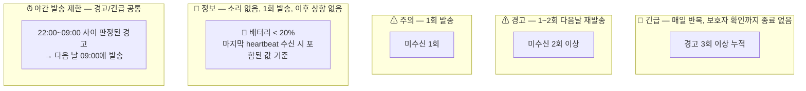

# Heartbeat 감지 및 경고 플로우차트

## 경고 등급 최종 확정 테이블

| 등급 | 조건 | 발송 |
|------|------|------|
| 🚨 긴급 | 경고 3회 이상 누적 | 매일 반복, 보호자 확인까지 종료 없음 |
| 🚨 긴급 | 대상자 긴급 도움 요청 (POST /api/v1/emergency) | 즉시 1회 발송 (에스컬레이션 독립) |
| ⚠ 경고 | 미수신 2회 이상 | 1~2회 다음날 재발송 |
| ⚠ 주의 | 미수신 1회 | 1회 발송 |
| 🔵 정보 | 배터리 < 20% (마지막 heartbeat 기준) | 1회 발송, 이후 상향 없음 |
| ✅ 정보 | 보호자 수동 경고 클리어 (PUT /api/v1/alerts/clear-all) | 클리어한 보호자 제외 다른 보호자에게 1회 발송 |


## 용어 설명

| 용어 | 값 | 의미 |
|------|-----|------|
| `suspicious` | `true` | 오늘 걸음 기록 없음 + worker fire 시점 화면 꺼짐 — 활동 증거 부재 (걸음 누적 + 발화 시점 스냅샷 모두 활동 신호 없음) |
| `suspicious` | `false` | 오늘 걸음 있음(하루 활동 확정) 또는 worker fire 시점 화면 깨어있음(발화 시점 기기 사용 중) — 활동 기록 확인 |
| `isInteractiveAtTrigger` | `true`/`false` | worker 콜백이 `ScreenState.isInteractive()`로 조회한 Android `PowerManager.isInteractive()` 값. worker fire **순간**의 1회 스냅샷이며 하루 전체 사용 여부가 아님. 포그라운드 호출부는 앱 포그라운드 자체가 interactive 증거이므로 항상 `true` 명시 전달 |


## 1. 클라이언트 — Heartbeat 수집 및 전송

```mermaid
flowchart TD
    Start([heartbeat 트리거])
    Start --> Trigger

    Trigger{트리거 종류?}
    Trigger -->|고정 시각 Android| WM[WorkManager 2계층<br/>one-off 정확 발화 + periodic 15분 폴링<br/>전송 성공 시 _onHeartbeatSent가<br/>schedule 호출 → one-off + periodic 둘 다<br/>cancel + 내일자 register<br/>race 방어: lastScheduledKey 성공 마커<br/>+ HeartbeatLockDatasource SQLite UNIQUE CAS<br/>cross-isolate 원자 락, TTL 30초]
    Trigger -->|고정 시각 iOS G+S 로컬알림| BG[LocalAlarmService 예약시각 정각<br/>사용자 탭 → 앱 진입 → 자동 전송]
    Trigger -->|공통| FG[앱 시작 / 백그라운드→포그라운드<br/>당일 미전송이면 자정 전까지<br/>무조건 자동 heartbeat 전송<br/>가드: isReportedToday + isScheduleInFuture]

    WM --> Collect
    BG --> Collect
    FG --> FGCheck{예약 시각 지남<br/>AND 오늘 미전송?}
    FGCheck -->|YES| Collect
    FGCheck -->|NO| End0([종료 — 이미 전송 완료])

    Collect[데이터 수집]
    Collect --> Steps[걸음수 조회<br/>pedometer_2<br/>오늘 자정 ~ 현재 누적<br/>steps_delta<br/>※ 자동/수동 모두 실제 값 전송]
    Collect --> ScreenCheck[화면 interactive 조회<br/>screen_state<br/>ScreenState.isInteractive<br/>※ worker=실측, 포그라운드=true]
    Collect --> Battery[배터리 상태 조회<br/>battery_level]

    Steps --> StepsCheck{steps_delta > 0?}
    StepsCheck -->|YES| Normal[suspicious = false<br/>걸음 = 활동 확정]
    StepsCheck -->|NO 또는 null| ScreenCheck2{isInteractiveAtTrigger = true?}
    ScreenCheck --> ScreenCheck2
    ScreenCheck2 -->|YES| Normal
    ScreenCheck2 -->|NO 또는 null| Suspicious[suspicious = true<br/>걸음 없음 + 발화 시점 기기 미사용<br/>활동 증거 부재]

    Battery --> BattCheck{배터리 ≤ 20%?}
    BattCheck -->|YES| SubjectNoti[대상자 로컬 알림<br/>📱 충전이 필요합니다<br/>배터리가 부족합니다<br/>충전하지 않으면 안부 확인이<br/>중단될 수 있습니다]
    BattCheck -->|NO| Build

    SubjectNoti --> Build

    Suspicious --> Build
    Normal --> Build

    Build[heartbeat 데이터 구성<br/>battery_level 포함]

    Build --> Network{네트워크 연결?}

    Network -->|연결됨| Send[서버 전송<br/>POST /api/v1/heartbeat]
    Network -->|미연결| Queue[로컬 큐 저장<br/>SharedPreferences]

    Queue --> LocalNoti1[대상자 로컬 알림<br/>📱 인터넷 연결이 꺼져 있습니다<br/>안부 확인이 전송되지 않고 있으며<br/>보호자에게 경고가 발생할 수 있습니다]

    Send --> AlarmReset[로컬 안전망 알림 갱신<br/>기존 알림 cancel(예약+표시 모두 제거)<br/>다음날 동일 시각으로 재예약<br/>iOS: heartbeat 시각 정시(기본 18:00)<br/>Android: heartbeat 시각 + 3시간(기본 21:00)<br/>매일 반복]

    AlarmReset --> End1([종료 — 다음 주기 대기])

    LocalNoti1 --> End2([종료 — 네트워크 복구 시 재전송])
```


## 2. 서버 — Heartbeat 수신 후 판정

```mermaid
flowchart TD
    Receive([서버: heartbeat 수신])
    Receive --> UpdateLastSeen[last_seen 갱신]

    UpdateLastSeen --> TodayCheck{오늘(기기 로컬 타임존) 이미<br/>heartbeat 수신 여부?}
    TodayCheck -->|이미 수신 + suspicious=true| ForceNormal[suspicious 강제 false<br/>하루 첫 heartbeat에서만 판정]
    TodayCheck -->|첫 heartbeat| BattCheck

    ForceNormal --> BattCheck

    BattCheck{battery_level < 20%?}
    BattCheck -->|YES| BattNoti[🔵 정보 등급<br/>보호자 Push 알림 소리 없음<br/>🔋 배터리 부족<br/>충전이 필요합니다]
    BattCheck -->|NO| AlertActive
    BattNoti --> AlertActive

    AlertActive{기존 경고 활성 중?}
    AlertActive -->|YES| SuspiciousFirst{suspicious?}

    SuspiciousFirst -->|false| Resolve[경고 완전 해소<br/>보호자 Push 알림<br/>✅ 대상자의 안부 확인이<br/>정상 복귀되었습니다]
    SuspiciousFirst -->|true| Downgrade[경고 등급 하향<br/>warning / urgent → caution<br/>정상 복귀 알림 없음<br/>안부 신호만 수신, 활동 기록 없음]

    AlertActive -->|NO| CheckSuspicious{suspicious?}
    Resolve --> StatusNormal([✅ 정상<br/>센서 움직임 감지 — 사용 확인])
    Downgrade --> Wait1

    CheckSuspicious -->|false| StatusNormal
    CheckSuspicious -->|true| Wait1([⏱ suspicious_count 기반 보호자 경고 에스컬레이션<br/>1회 → caution + caution_suspicious<br/>2회 → warning + warning_suspicious<br/>3회+ → urgent + urgent_suspicious<br/>※ scheduler 미수신 경로와 별도 문구 사용])

    StatusNormal --> SaveNoti[보호자 알림 DB 저장<br/>guardian_notifications<br/>alert_level: info<br/>is_push_sent: true/false]
    SaveNoti --> StepsNoti{manual=false<br/>AND steps_delta != null<br/>AND steps_delta > 0?}
    StepsNoti -->|YES| StepsCompare[활동 정보 알림 DB 저장<br/>🚶 활동 정보<br/>오늘 N보를 걸으셨습니다.<br/>Push 발송 없음<br/>※ 수동 보고는 manual=true 가드로 진입 안 됨<br/>(이력 집계용 steps_delta는 그대로 heartbeat_logs에 저장)]
    StepsNoti -->|NO| End3([완료])
    StepsCompare --> End3
```


## 3. 서버 — Heartbeat 미수신 시 경고 플로우

```mermaid
flowchart TD
    Scheduler([서버 APScheduler: 매 분 정각 실행<br/>CronTrigger(second=0)<br/>heartbeat 시각 + 2시간 경과 시 미수신 체크])
    Scheduler --> FindMissing[해당 시각까지<br/>heartbeat 미수신 대상자 조회]

    FindMissing --> SubActive{보호자<br/>구독 활성?}
    SubActive -->|NO| Skip([알림 미발송<br/>heartbeat는 계속 수신])
    SubActive -->|YES| CheckLastBatt{마지막 heartbeat의<br/>battery_level < 20%?}

    CheckLastBatt -->|YES| BattDead[🔵 정보 등급 판정<br/>배터리 방전 추정]
    BattDead --> BattDeadNoti[보호자 Push 알림 정보 등급 소리 없음<br/>🔋 배터리 방전 추정<br/>충전 후 자동으로 정상 복귀됩니다]
    BattDeadNoti --> BattSave[guardian_notifications DB 저장<br/>alert_level: info, is_push_sent: true]
    BattSave --> BattEnd([1회 발송 후 종료<br/>이후 미수신 지속되어도 상향 없음<br/>heartbeat 수신 시 자동 해소])

    CheckLastBatt -->|NO| MissCount{누적 미수신 횟수?}

    MissCount -->|1회| Caution[⚠ 주의 등급 판정]
    Caution --> CautionNoti[보호자 Push 알림 주의 등급<br/>⚠ 안부 확인<br/>오늘 안부 확인이 없습니다]
    CautionNoti --> CautionSave[guardian_notifications DB 저장<br/>alert_level: caution, is_push_sent: true]
    CautionSave --> NextDay0([다음 날 재확인])

    MissCount -->|2회 이상| Warning[⚠ 경고 등급 판정]
    Warning --> NightCheck1{현재 시각<br/>22:00~09:00?}

    NightCheck1 -->|NO 주간| WarningNoti[보호자 Push 알림 경고 등급<br/>⚠ 안부 확인<br/>안부 확인이 없습니다<br/>통신 불가 상태일 수 있습니다]
    NightCheck1 -->|YES 야간| Delay1([DB에 기록 후<br/>다음 날 09:00에 발송 예약])
    Delay1 --> WarningNoti

    WarningNoti --> WarningSave[guardian_notifications DB 저장<br/>alert_level: warning, is_push_sent: true]
    WarningSave --> WarningRepeat{경고 횟수?}
    WarningRepeat -->|2회 이하| NextDay1([다음 날 같은 시각에 재발송])
    WarningRepeat -->|3회 이상| UpgradeUrgent[🚨 긴급 등급으로 상향]
    UpgradeUrgent --> NightCheck2{현재 시각<br/>22:00~09:00?}

    NightCheck2 -->|NO 주간| UrgentNoti[보호자 Push 알림 긴급 등급<br/>🚨 긴급: 대상자 확인 필요<br/>즉시 확인이 필요합니다]
    NightCheck2 -->|YES 야간| Delay2([DB에 기록 후<br/>다음 날 09:00에 발송 예약])
    Delay2 --> UrgentNoti

    UrgentNoti --> UrgentSave[guardian_notifications DB 저장<br/>alert_level: urgent, is_push_sent: true]
    UrgentSave --> DailyRepeat([매일 같은 시각에 반복<br/>보호자 확인까지 종료 없음])
```


## 4. 보호자 알림 자정 정리 스케줄러


**보호자 알림 조회 흐름:**
```
보호자 앱 실행 또는 알림 목록 화면 진입
    ↓
GET /api/v1/notifications 호출
    ↓
서버: 당일(KST) guardian_notifications 반환 (시간순)
    ↓
클라이언트: is_push_sent = false 항목도 목록에 표시
    ↓
자정 이후 → 서버가 전날 알림 삭제 → 다음 날 00:00부터 새 목록 시작
```


## 5. 적응형 Heartbeat 주기 상태도


## 6. 경고 등급 요약




## 7. 대상자 긴급 도움 요청 플로우

> 대상자가 앱에서 직접 긴급 버튼을 눌러 보호자 전원에게 즉시 urgent 알림을 발송하는 플로우.
> 기존 heartbeat 경고 에스컬레이션(suspicious_count, days_inactive)과 완전히 독립 동작한다.

```mermaid
flowchart TD
    Start([대상자: 🚨 도움이 필요해요 버튼 탭])
    Start --> Confirm{확인 다이얼로그<br/>보호자 전원에게 긴급 알림이<br/>발송됩니다.<br/>현재 위치도 함께 전달됩니다.<br/>정말 도움을 요청하시겠습니까?}

    Confirm -->|취소| End0([종료])
    Confirm -->|긴급 요청 보내기| PermCheck[Permission.locationWhenInUse.request<br/>권한은 §9.0 권한 화면에서 up-front로 이미 요청됨<br/>긴급 버튼 탭 시점은 상태 확인 + 허용 상태면 즉시 통과]

    PermCheck --> PermResult{권한 허용?}
    PermResult -->|거부/영구거부| NoLoc[location = null 으로 전송 계속]
    PermResult -->|허용| SvcCheck[Geolocator.isLocationServiceEnabled]

    SvcCheck --> SvcResult{위치 서비스 ON?}
    SvcResult -->|OFF| NoLoc
    SvcResult -->|ON| LastKnown[Geolocator.getLastKnownPosition<br/>1차 폴백 — 다른 앱이 최근 GPS를 썼으면 수 ms 내 반환]

    LastKnown --> LastKnownResult{캐시 위치 존재?}
    LastKnownResult -->|YES| WithLoc[location = &#123;lat, lng, accuracy, captured_at&#125;]
    LastKnownResult -->|NO| GetLoc[Geolocator.getCurrentPosition<br/>2차 폴백 — medium accuracy, 10s timeout<br/>medium은 GPS+Wi-Fi+셀룰러 병용 → 실내에서도 fix 가능]

    GetLoc --> GetResult{GPS fix 성공?}
    GetResult -->|타임아웃/예외| NoLoc
    GetResult -->|성공| WithLoc

    NoLoc --> Send[POST /api/v1/emergency<br/>device_id + optional location]
    WithLoc --> Send

    Send --> Auth{require_subject<br/>인증 확인}
    Auth -->|실패| Error([에러 — 대상자만 호출 가능])
    Auth -->|성공| CreateAlert[alerts 테이블에 즉시 생성<br/>alert_level: urgent<br/>note: emergency_request<br/>days_inactive: 0]

    CreateAlert --> SaveNoti[notification_events 저장<br/>message_key: emergency<br/>alert_level: urgent<br/>location_lat/lng/accuracy/captured_at<br/>location 있을 때만]

    SaveNoti --> FindGuardians[연결된 보호자 전원 조회<br/>guardians + devices JOIN]

    FindGuardians --> Push[보호자 전원에게 긴급 Push 발송<br/>FCM data에 lat/lng/accuracy 포함 가능<br/>asyncio.gather 병렬, DND 무시, 구독 만료 무관]

    Push --> Response([200 OK 응답<br/>클라: 위치 포함 여부에 따라 스낵바 분기])

    style CreateAlert fill:#FFEBEE,stroke:#B71C1C
    style Push fill:#FFEBEE,stroke:#B71C1C
```



**긴급 도움 요청의 특성:**

| 항목 | 동작 |
|------|------|
| 경고 등급 | 즉시 urgent (caution→warning→urgent 단계 생략) |
| 기존 카운터 | suspicious_count, days_inactive 변경 없음 |
| DND | 무시 (항상 발송) |
| 구독 상태 | 무관 (만료되어도 발송) |
| 보호자 범위 | 연결된 전원 |
| 반복 발송 | 없음 (1회 즉시 발송) |
| 클라이언트 | 확인 다이얼로그로 오탐 방지 |
| 위치 | optional — 사용자 동의 + 서비스 ON일 때 2단계 폴백으로 획득: (1) `getLastKnownPosition` 캐시 위치 선행 (수 ms) → (2) `getCurrentPosition` medium 정확도 + 10초 타임아웃. 거부/실패 어떤 경우에도 긴급 API 호출 자체는 항상 실행. S 모드 홈과 G+S 안전코드 페이지 양쪽 긴급 버튼이 공통 `captureEmergencyLocation()` 헬퍼를 공유 |


## 8. Heartbeat 예약 실행 계층 (WorkManager + 로컬 알림 안전망)

> **1차 (Android)**: WorkManager 2계층으로 등록한다 — (a) **one-off**: 예약시각에 정확히 1회 fire. (b) **periodic 15분**: 안전망 폴링. one-off가 OEM 배터리 절약/Doze 등으로 누락되어도 최대 15분 내 백업 발화 + 화면 켜짐 Doze 해제 piggyback 효과. **두 task 모두** 전송 성공 시 `HeartbeatService._onHeartbeatSent`가 `HeartbeatWorkerService.schedule()` 호출 → `cancelByUniqueName` + `register*Task` 패턴으로 **둘 다 cancel + 내일자 register** (자동/수동/pending 큐 모든 성공 경로 공통, periodic의 self-cancel은 currently 실행 중인 task는 유지하고 다음 예약만 취소하므로 안전). worker 콜백 끝의 동일 schedule() 호출은 안전망으로 유지(idempotent — schedule이 cancel+register 패턴이라 두 번 호출되어도 결과 동일). retry 3회 실패 시 자동 경로(`manual=false`)는 `LocalAlarmService.notifySendFailed()`로 사용자 안내 알림 표시(payload 무시 — 탭하면 앱 포그라운드 전환만, 2차 안전망의 자동 재전송이 처리). one-off와 periodic이 거의 동시에 fire되는 race는 **3선 방어**로 차단한다: (1) 콜백 진입 시 `lastHeartbeatDate == 오늘` 검사(콜백 레벨 1차 거름), (2) `HeartbeatService._executeInternal`에서 `lastScheduledKey`(성공 마커 — API 전송 성공 후에만 save) 검사, (3) `HeartbeatLockDatasource.tryAcquire(scheduledKey)` — SQLite `UNIQUE` INSERT 기반 **cross-isolate 원자 락**. 과거에는 SharedPreferences 기반 `heartbeat_in_flight` 30초 TTL mutex를 사용했으나, WorkManager 워커마다 새 isolate가 생성되는 구조에서 `reload → check → save` 패턴이 CAS가 아니라 두 isolate가 같은 ms에 진입하면 둘 다 통과하는 TOCTOU 윈도우가 존재했다. SQLite `UNIQUE` 제약은 Android WAL로 cross-isolate writer를 진짜 직렬화해 하나만 INSERT 성공, 나머지는 `UniqueConstraintError`로 즉시 실패한다. TTL 30초 초과 stale 락은 `tryAcquire` 진입 시 동일 트랜잭션에서 일괄 청소되어 crashed isolate가 남긴 락을 새 진입자가 이어받는다. iOS는 BGTaskScheduler 불안정성 때문에 사용하지 않는다.
> **2차**: 앱 시작 / 백그라운드→포그라운드 복귀 시 당일 미전송이면 **자정 전까지 무조건** 자동 전송한다. 가드는 `isReportedToday`(이미 전송 차단) + Android의 `isScheduleInFuture`(예약시각 이전 차단) 두 개로 단순화 — 자정이 유일한 의미 경계. iOS S/G+S는 `Platform.isAndroid &&` 조건이 false라 시각 가드 자체가 없음. 이전에 있던 `isScheduleTooOld`(예약 +3h 초과 차단) 가드는 늦은 정상 복귀 신호의 가치(보호자 stale 경고 즉시 해소 + WorkManager 정시 사이클 즉시 정상화 + iOS와의 동작 통일)가 차단 효과보다 커서 제거됐다. 진입 시 `isReportedToday=false`인데 오늘 날짜의 `lastScheduledKey`가 남아 있으면 stale ghost로 판단하고 제거한다(`_clearStaleScheduledKey`, 커밋 4260e53) — Worker가 중도 종료되어 남긴 성공 마커가 2차 안전망을 차단하지 않도록 하는 전환기 방어선으로, SubjectHome과 GuardianSafetyCode 양쪽 진입 시 수행한다. 늦은 전송 성공 시 `_onHeartbeatSent`가 WorkManager를 즉시 내일자로 재등록하고 잔존 send_failed 알림도 제거한다.
> **3차 (안전망)**: 일일 로컬 안부 확인 알림이 OS에 의해 표시되며, 사용자가 탭하면 앱이 열린다. 알림 자체에서 heartbeat를 전송하지 않고, 홈 화면의 `onInit`/`onResumed`에서 예약시각 경과 + 미전송 시 자동 전송한다. **iOS**는 heartbeat 예약 시각 정시에 fire (BGTaskScheduler 미사용으로 사실상 PRIMARY 트리거). **Android**는 heartbeat 예약 시각 + 3시간에 fire — WorkManager one-off + periodic 15분 + 앱 열기(2차)가 모두 실패해 worker 자체가 OEM/사용자에 의해 cancel된 시나리오를 메우는 LAST-RESORT. 자정 넘기면 자연 롤오버되어 다음 날 새벽으로 예약된다(예: 22:30 → 다음 날 01:30). payload 분리: iOS `gs_deadman`(G+S 라우팅), Android `safety_net`(no-op, 앱 진입만). heartbeat 성공 시 `_onHeartbeatSent`가 `schedule(forceNextDay: true)`로 cancel + 내일자 재예약하며, `cancel(_alarmId)`이 예약 + 표시 중 알림을 모두 제거하므로 stale 알림 잔존 없음.

```mermaid
flowchart TD
    subgraph 최초설치[대상자 앱 최초 등록]
        Install([대상자 모드 선택<br/>서버 등록 완료])
        Install --> FirstWM[WorkManager 예약<br/>one-off 예약시각 정각<br/>+ periodic 15분 폴링<br/>heartbeat 시각 기본 18:00]
        FirstWM --> FirstAlarm[일일 로컬 안전망 알림 예약<br/>iOS: heartbeat 시각 정시(기본 18:00)<br/>Android: heartbeat 시각 + 3시간(기본 21:00)<br/>매일 반복]
    end

    FirstAlarm --> Wait

    subgraph 정상주기[정상 동작 주기]
        Wait([다음 heartbeat 대기])
        Wait -->|WorkManager/BGTaskScheduler 실행| Collect[heartbeat 수집 및 서버 전송]
        Collect --> Reschedule[_onHeartbeatSent 일괄 처리:<br/>Android: one-off + periodic 둘 다<br/>cancel + 내일자 register<br/>iOS: 로컬 안전망 알림 내일 재예약<br/>Android: send_failed 알림 제거]
        Reschedule --> Wait
        Wait -->|앱 실행 또는 포그라운드 복귀| AutoSend{예약 시각 지남<br/>AND 오늘 미전송?}
        AutoSend -->|YES| Collect
        AutoSend -->|NO| ServerSync[서버에서 최신 heartbeat 시각 조회<br/>WorkManager 재예약 + iOS: 로컬 알림 재예약]
        ServerSync --> Wait
    end

    Wait -->|iOS: BGTask 미실행<br/>heartbeat 예약 시각 정시 도래| Alarm
    Wait -->|Android: worker 영구 cancel<br/>heartbeat 시각 + 3시간 도래| Alarm

    subgraph 안전망[안전망 동작 — 일일 로컬 알림]
        Alarm[OS가 로컬 알림 표시<br/>💗 안부 확인이 필요합니다<br/>이 메시지 알림을 한 번 터치해 주세요]

        Alarm --> UserAction{사용자 반응?}

        UserAction -->|알림 탭| AppOpen[앱 포그라운드 전환<br/>알림 자체에서 heartbeat 전송 안 함<br/>홈 화면 onInit/onResumed에서<br/>예약시각 경과+미전송 시 자동 전송]
        AppOpen --> Wait

        UserAction -->|알림 무시| Repeat[다음 날 같은 시각에 다시 알림<br/>앱을 열 때까지 매일 반복]
        Repeat --> UserAction

        Repeat -.->|동시에| ServerAlert[서버 측 미수신 경고<br/>보호자에게 Push 알림 발송<br/>→ 차트 3 경고 플로우 진입]
    end
```

**Heartbeat 예약 실행이 실패하는 상황 및 보완:**

| 상황 | WorkManager/BGTask | 앱 열기 자동 전송 | 로컬 안전망 알림 | 결과 |
|------|-------------------|-----------------|----------------|------|
| 정상 동작 (18:00) | 실행 → heartbeat 성공 | 이미 전송 완료 → 건너뜀 | _onHeartbeatSent가 cancel + 내일자 재예약 → 표시 안 됨 | 정상 |
| 앱 스와이프 종료 (Android OneUI/MIUI) + 화면 꺼짐 Doze | one-off **지연/미실행 가능** → periodic 15분 폴링이 최대 15분 내 백업 발화 | 앱 열면 자동 전송 | Android: +3h 안전망 알림(기본 21:00)이 사용자 유도 — periodic까지 막힌 영구 cancel 케이스의 마지막 보루 | periodic 폴링으로 대부분 복구. 모두 실패해도 +3h 알림이 받아냄 |
| 앱 강제 종료 (iOS 스와이프) | **미실행** (Apple 정책) | 앱 열면 자동 전송 | **iOS: 정시 알림(기본 18:00) 표시 → 탭 시 복구** | 사용자가 앱을 열면 복구 |
| 네트워크 장시간 불가 | 실행되나 전송 실패 → 큐 저장 | 전송 실패 → 큐 저장 | **iOS: 정시 18:00 표시 / Android: retry 3회 실패 시 send_failed 즉시 표시 + +3h 안전망 알림 21:00** | 네트워크 복구 + 앱 실행 시 복구 |
| 알림 권한 거부 | 영향 없음 (정상 실행) | 영향 없음 (정상 전송) | **표시 불가** | BGTask/WorkManager + 앱 열기로 대응 |

※ 위 시각은 기본값(18:00) 기준 — iOS 안전망 18:00, Android 안전망 21:00.
※ 예약 시각 변경은 대상자 앱에서만 가능. 변경 시 WorkManager 재예약 + 일일 로컬 안전망 알림 재예약이 동시에 수행됨.


## Mermaid 렌더링 방법

- **VS Code**: [Markdown Preview Mermaid Support](https://marketplace.visualstudio.com/items?itemName=bierner.markdown-mermaid) 확장 프로그램 설치 → `Ctrl+Shift+V`로 미리보기
- **GitHub**: push하면 자동 렌더링
- **웹**: [Mermaid Live Editor](https://mermaid.live/)에 코드 붙여넣기
