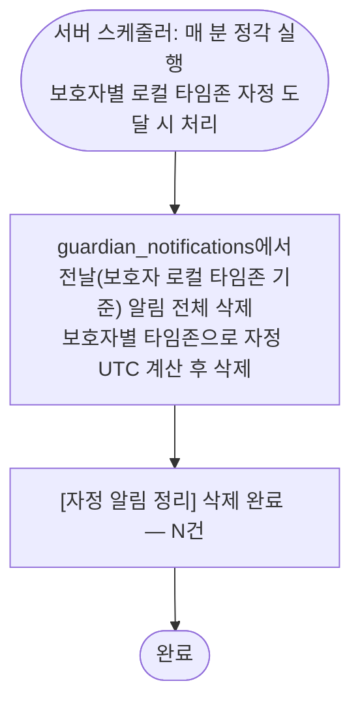
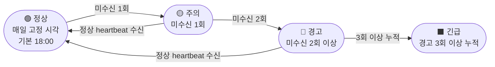
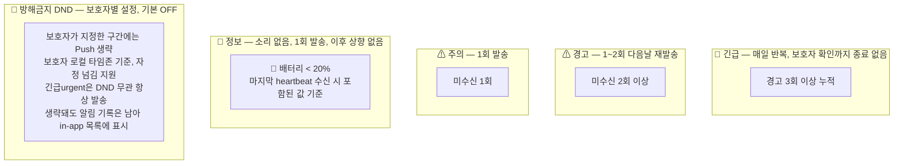

# Heartbeat 감지 및 경고 플로우차트

## 경고 등급 최종 확정 테이블

| 등급 | 조건 | 발송 |
|------|------|------|
| 🚨 긴급 | 경고 3회 이상 누적 | 매일 반복, 보호자 확인까지 종료 없음 |
| 🚨 긴급 | 대상자 긴급 도움 요청 (POST /api/v1/emergency) | 즉시 1회 발송 (에스컬레이션 독립) |
| ⚠ 경고 | 미수신 2회 이상 | 1~2회 다음날 재발송 |
| ⚠ 주의 | 미수신 1회 | 1회 발송 |
| 🔵 정보 | 배터리 < 20% (마지막 heartbeat 기준) | 1회 발송, 이후 상향 없음 |
| ✅ 정보 | 보호자 수동 경고 클리어 (PUT /api/v1/alerts/clear-all) | 클리어한 보호자 제외 다른 보호자에게 1회 발송 |


## 용어 설명

| 용어 | 값 | 의미 |
|------|-----|------|
| `suspicious` | `true` | 오늘 걸음 기록 없음 + worker fire 시점 화면 꺼짐 — 활동 증거 부재 (걸음 누적 + 발화 시점 스냅샷 모두 활동 신호 없음) |
| `suspicious` | `false` | 오늘 걸음 있음(하루 활동 확정) 또는 worker fire 시점 화면 깨어있음(발화 시점 기기 사용 중) — 활동 기록 확인 |
| `isInteractiveAtTrigger` | `true`/`false` | worker 콜백이 `ScreenState.isInteractive()`로 조회한 Android `PowerManager.isInteractive()` 값. worker fire **순간**의 1회 스냅샷이며 하루 전체 사용 여부가 아님. 포그라운드 호출부는 앱 포그라운드 자체가 interactive 증거이므로 항상 `true` 명시 전달 |


## 1. 클라이언트 — Heartbeat 수집 및 전송

```mermaid
flowchart TD
    Start([heartbeat 트리거])
    Start --> Trigger

    Trigger{트리거 종류?}
    Trigger -->|"고정 시각 Android (0차·정시)"| ALARM[AlarmManager.setAndAllowWhileIdle<br/>딥 Doze를 관통해 예약시각 +0~60분에 발화<br/>실측 +7~32분 n=6, 상한 60분 보장<br/>⚠️ 알람 자체는 네트워크 불가 — allowed=NONE<br/>방화벽을 여는 것은 expedited job이고<br/>창 길이 = 그 job의 수명<br/>HeartbeatWindowHolderWorker가 최대 90초 창을 유지하고<br/>전송은 평소의 BackgroundWorker가 그 창 안에서 수행<br/>재무장은 onReceive 첫 줄 + BOOT_COMPLETED/MY_PACKAGE_REPLACED<br/>⚠️ 1~3차를 대체하지 않음 — 하루 1회라 같은 날 재시도 없음]
    ALARM --> WM
    Trigger -->|고정 시각 Android| WM[WorkManager 2계층<br/>one-off 정확 발화 + periodic 15분 폴링<br/>예약시각 -15분 이전 fire는 평소 스킵<br/>단 2일 이상 미전송 갭이면 회복 전송(정시 슬롯 미소비)<br/>전송 성공 시 _onHeartbeatSent가<br/>schedule 호출 → one-off + periodic 둘 다<br/>cancel + 내일자 register<br/>race 방어: lastScheduledKey 성공 마커<br/>+ HeartbeatLockDatasource SQLite UNIQUE CAS<br/>cross-isolate 원자 락, TTL 30초]
    Trigger -->|고정 시각 iOS G+S 로컬알림| BG[LocalAlarmService 예약시각 정각<br/>사용자 탭 → 앱 진입 → 자동 전송]
    Trigger -->|공통| FG[앱 시작 / 백그라운드→포그라운드<br/>당일 미전송이면 자정 전까지<br/>무조건 자동 heartbeat 전송<br/>가드: isReportedToday + isScheduleInFuture]

    WM --> WMRecov{예약시각 -15분 이전<br/>fire?}
    WMRecov -->|NO 정시 경로| Collect
    WMRecov -->|YES + 2일 이상<br/>미전송 갭| RecoveryWorker
    WMRecov -->|YES 그 외| End0
    BG --> Collect
    FG --> FGCheck{예약 시각 지남<br/>AND 오늘 미전송?}
    FGCheck -->|YES| Collect
    FGCheck -->|NO 미전송 갭| RecoveryFG
    FGCheck -->|NO 그 외| End0([종료 — 이미 전송 완료 / 정시 대기])

    RecoveryWorker[worker 회복 전송<br/>execute(recovery: true) → _executeRecovery<br/>포그라운드 회복과 동일 경로<br/>steps_delta=null, suspicious=false<br/>전용 키 recovery_날짜 + 마커 lastRecoveryDate<br/>정시 슬롯 미소비 — lastHeartbeatDate/<br/>lastScheduledKey 미갱신<br/>재무장은 콜백 진입부에서<br/>네트워크보다 먼저 완료됨<br/>Android 전용]
    RecoveryWorker --> RecovEndW([종료 — 예약시각 정시 전송이 그대로 수행되어<br/>그날 걸음수가 온전히 기록됨])

    RecoveryFG[포그라운드 회복 전송<br/>execute(recovery: true) → _executeRecovery<br/>steps_delta=null, suspicious=false<br/>전용 키 recovery_날짜 + 마커 lastRecoveryDate<br/>정시 슬롯 미소비 — lastHeartbeatDate/<br/>lastScheduledKey 미갱신, 재예약 안 함]
    RecoveryFG --> RecovEndFG([종료 — 예약시각 정시 전송은 그대로 수행])

    Collect[데이터 수집]
    Collect --> Steps[걸음수 조회<br/>pedometer_2<br/>오늘 자정 ~ 현재 누적<br/>steps_delta<br/>※ 자동/수동 모두 실제 값 전송]
    Collect --> ScreenCheck[화면 interactive 조회<br/>screen_state<br/>ScreenState.isInteractive<br/>※ worker=실측, 포그라운드=true]
    Collect --> Battery[배터리 상태 조회<br/>battery_level]

    Steps --> StepsCheck{steps_delta > 0?}
    StepsCheck -->|YES| Normal[suspicious = false<br/>걸음 = 활동 확정]
    StepsCheck -->|NO 또는 null| ScreenCheck2{isInteractiveAtTrigger = true?}
    ScreenCheck --> ScreenCheck2
    ScreenCheck2 -->|YES| Normal
    ScreenCheck2 -->|NO 또는 null| Suspicious[suspicious = true<br/>걸음 없음 + 발화 시점 기기 미사용<br/>활동 증거 부재]

    Battery --> BattCheck{배터리 ≤ 20%?}
    BattCheck -->|YES| SubjectNoti[대상자 로컬 알림<br/>📱 충전이 필요합니다<br/>배터리가 부족합니다<br/>충전하지 않으면 안부 확인이<br/>중단될 수 있습니다]
    BattCheck -->|NO| Build

    SubjectNoti --> Build

    Suspicious --> Build
    Normal --> Build

    Build[heartbeat 데이터 구성<br/>battery_level 포함]

    Build --> Memo[★ 전송 전에 보류 큐 저장<br/>savePending SharedPreferences<br/>Doze 창 만료·lmkd 킬로 중도 사망해도<br/>그날 걸음수를 잃지 않기 위함]

    Memo --> Send[서버 전송 POST /api/v1/heartbeat<br/>전체 20초 데드라인<br/>연결 실패면 백오프 생략<br/>※ 사전 네트워크 체크 없음 — connectivity_plus의<br/>Doze 오판 때문에 제거됨 커밋 56f38e8]

    Send --> SendOk{도달?}
    SendOk -->|성공| ClearQ[clearPendingIfMatches<br/>내가 저장한 것일 때만 삭제<br/>남의 메모 삭제 방지]
    SendOk -->|실패| Fail[메모 유지 — 이미 저장돼 있음<br/>notifySendFailed 로컬 알림<br/>one-off만 내일자 재무장 periodic 유지]

    ClearQ --> AlarmReset[로컬 안전망 알림 갱신 — iOS 전용<br/>기존 알림 cancel(예약+표시 모두 제거)<br/>다음날 heartbeat 시각 정시(기본 18:00)로 재예약<br/>매일 반복<br/>Android는 로컬 안전망 알림 없음 — 서버 푸시 subject_safety_net이 담당<br/>Android LocalAlarmService.schedule()은 기존 알림 cancel 후 즉시 return]

    AlarmReset --> End1([종료 — 다음 주기 대기])

    Fail --> End2([종료 — 다음 발화가 보류 큐를 비운다])
```


### 1.1 보류 큐 재전송의 날짜 귀속 (걸음수 이틀 손실 방지)

보류 큐(`HeartbeatLocalDatasource`, **1건만 보관**)에 담긴 payload는 자기가 원래 어느 날 것인지를 `scheduled_key`에 갖고 있다. `_sendPendingInternal`은 그 **날짜가 오늘인지**로 마커 갱신 여부를 가른다(`heartbeatPayloadIsFromToday`). ⚠️ 키 문자열 전체가 아니라 **날짜만** 비교한다 — 예약시각은 `_syncScheduleFromServer`(포그라운드 진입마다)로도 바뀌므로, 전체 비교하면 오늘 payload가 지난 기록으로 오분류돼 같은 날 기록 2건이 서버에 도착하고 `auto_report` Push가 중복된다. 서버 판정도 날짜만 보므로 기준을 일치시켜야 한다. 수동 보고는 키가 없어 `timestamp`의 로컬 날짜로 폴백한다.

| 보류 payload의 키 | 처리 |
|---|---|
| **날짜가 오늘** (18:00 전송 실패 → 18:15 periodic이 큐를 비움) | 이게 곧 오늘의 정시 전송 → `lastHeartbeatDate`/`lastScheduledKey` 갱신 + `_onHeartbeatSent` |
| **날짜가 지난 날** (n일 실패 → n+1일에 뒤늦게 전송) | **마커 미갱신.** 큐 비우기 + `cancelSendFailed`/`cancelSubjectSafetyNet`만. 재예약도 하지 않음 |

⚠️ **지난 날짜 payload로 오늘 마커를 찍으면 안 된다** — 같은 `execute()` 안에서 뒤이어 실행되는 `_executeInternal`이 `lastScheduledKey` 일치로 스킵되어 **그날 heartbeat가 아예 나가지 않고 걸음수 막대가 0이 된다.** 마커를 비워두면 두 건이 각각 전송되고, 서버가 `scheduled_key` 날짜로 각자의 날에 귀속시킨다(§2 참조). 재예약을 생략하는 이유도 같다 — 뒤따르는 오늘 전송의 성공 경로(`_onHeartbeatSent`)가 담당한다.

**회복 전송은 진입 시 지난 날짜 보류 메모를 먼저 비운다**(`execute()`의 recovery 분기) — 회복 전송은 걸음수를 싣지 않으므로, 이 flush가 없으면 n일 걸음수가 n+1일 아침 회복 성공 뒤에도 그날 정시 전송(오후)까지 큐에서 대기한다(2026-08-20 실측: 09:19 회복 성공 → 8/19분 81보는 15:35에야 도착, 6시간 지연). ⚠️ **오늘 날짜 메모는 여기서 보내지 않는다** — `_sendPendingInternal`이 오늘 payload에 `lastScheduledKey`를 찍어 정시 슬롯을 소비하면 예약시각 정시 전송이 통째로 스킵되어 그날 걸음수가 0이 된다.

**알려진 한계**: 보류 큐는 1건만 보관하고 새 실패가 덮어쓰므로, n일·n+1일이 연속 실패하면 n일 payload가 사라져 n일 막대는 0으로 남는다(마지막 실패일만 복구). 안전에는 영향 없음 — 보호자 미수신 경고는 서버 스케줄러가 클라 큐와 무관하게 발송·해소한다.


## 2. 서버 — Heartbeat 수신 후 판정

```mermaid
flowchart TD
    Receive([서버: heartbeat 수신])
    Receive --> Classify{scheduled_key 날짜 == 도착일?<br/>services/heartbeat_keys.py}

    Classify -->|"키 날짜 < 도착일 (n일 기록이 n+1일에 도착)"| Backfill[지난 기록 보정 — 이력 전용<br/>last_seen·battery_level 갱신, 걸음수는 미갱신<br/>heartbeat_logs INSERT<br/>suspicious=false면 활성 경고 해소 + suspicious_count 리셋<br/>SOS는 해소 대상 제외<br/>auto_report·오늘 N보·suspicious 에스컬레이션<br/>·배터리 부족 Push 모두 생략]
    Backfill --> EndBF([완료 — 오늘의 안부 확인으로 세지 않음])

    Classify -->|"recovery_날짜 (살아있음 신호)"| Liveness[경고 해소만 수행<br/>steps_delta 없음<br/>auto_report 미발송<br/>당일 첫 수신으로 세지 않음]
    Liveness --> EndLV([완료 — 정시 전송이 오늘 몫을 담당])

    Classify -->|"오늘 키 · 미래 키(시계 오차) · 수동 보고"| UpdateLastSeen[last_seen 갱신]

    UpdateLastSeen --> TodayCheck{오늘(기기 로컬 타임존) 이미<br/>heartbeat 수신 여부?<br/>※ 지난 기록·살아있음 신호는 카운트 제외}
    TodayCheck -->|이미 수신 + suspicious=true| ForceNormal[suspicious 강제 false<br/>하루 첫 heartbeat에서만 판정]
    TodayCheck -->|첫 heartbeat| BattCheck

    ForceNormal --> BattCheck

    BattCheck{battery_level < 20%?}
    BattCheck -->|YES| BattNoti[🔵 정보 등급<br/>보호자 Push 알림 소리 없음<br/>🔋 배터리 부족<br/>충전이 필요합니다]
    BattCheck -->|NO| AlertActive
    BattNoti --> AlertActive

    AlertActive{기존 경고 활성 중?}
    AlertActive -->|YES| SuspiciousFirst{suspicious?}

    SuspiciousFirst -->|false| Resolve[경고 완전 해소<br/>보호자 Push 알림<br/>✅ 정상 복귀<br/>보호 대상자의 안부가<br/>정상적으로 확인되었습니다]
    SuspiciousFirst -->|true| Downgrade[경고 등급 하향<br/>warning / urgent → caution<br/>정상 복귀 알림 없음<br/>안부 신호만 수신, 활동 기록 없음]

    AlertActive -->|NO| CheckSuspicious{suspicious?}
    Resolve --> StatusNormal([✅ 정상<br/>센서 움직임 감지 — 사용 확인])
    Downgrade --> Wait1

    CheckSuspicious -->|false| StatusNormal
    CheckSuspicious -->|true| Wait1([⏱ suspicious_count 기반 보호자 경고 에스컬레이션<br/>1회 → caution + caution_suspicious<br/>2회 → warning + warning_suspicious<br/>3회+ → urgent + urgent_suspicious<br/>※ scheduler 미수신 경로와 별도 문구 사용])

    StatusNormal --> SaveNoti[보호자 알림 DB 저장<br/>guardian_notifications<br/>alert_level: info<br/>is_push_sent: true/false]
    SaveNoti --> StepsNoti{manual=false<br/>AND steps_delta != null<br/>AND steps_delta > 0?}
    StepsNoti -->|YES| StepsCompare[활동 정보 알림 DB 저장<br/>🚶 활동 정보<br/>오늘 N보를 걸으셨습니다.<br/>Push 발송 없음<br/>※ 수동 보고는 manual=true 가드로 진입 안 됨<br/>(이력 집계용 steps_delta는 그대로 heartbeat_logs에 저장)]
    StepsNoti -->|NO| End3([완료])
    StepsCompare --> End3
```

**일자 귀속 규칙 (걸음수 차트 · 당일 알림 공통):** heartbeat 한 건이 "어느 날 것인가"는 **도착 시각(`server_ts`)이 아니라 `scheduled_key`의 날짜**로 정한다. 통신 장애로 n일 기록이 n+1일에 도착하면 도착 기준으로는 걸음수가 n+1일 막대에 들어가고 n일은 0이 된다.

- **걸음수 차트**(`get_step_history`): `scheduled_key` 날짜로 버킷팅하고, 없으면(수동 보고) `server_ts`로 폴백한다. 읽기 시점 재분류이므로 **이미 저장된 30일치 기록도 소급 교정**된다(마이그레이션 불필요). 조회 범위는 창 시작보다 하루 앞에서 떠 경계 유실을 막는다.
- **당일 알림**(`auto_report` / `오늘 N보`): `scheduled_key` 날짜가 도착일과 같은 기록만 "오늘의 안부 확인"으로 센다. `is_first_today` 판정 쿼리도 그 조건으로 걸러, 지난 기록이나 살아있음 신호가 먼저 도착했다는 이유로 진짜 오늘 heartbeat가 "첫 수신 아님"에 걸려 걸음수 알림을 잃는 일이 없게 한다.
- **판정은 `키 날짜 < 도착일`(엄격히 과거)이다.** `!=`가 아닌 이유: 도착일은 `devices.timezone`으로 계산하므로 기기 이동·시계 오차 시 키 날짜가 앞설 수 있고, 그때 오분류하면 정상 당일 heartbeat의 알림이 조용히 사라진다. 미래 날짜는 기존 동작(당일 처리)으로 흘려보낸다.
- **`battery_level`은 저장하되 알림만 생략한다**: 이 값은 표시 전용이 아니라 미수신 스케줄러가 '배터리 방전 추정' 분기에 읽는 입력이고, 계약이 "마지막으로 수신한 heartbeat의 배터리"라 저장을 건너뛰면 더 오래된 값이 남는다. "지금 부족하다"고 주장하는 Push만 막는다. 걸음수(`devices.steps_delta`)는 반대로 덮어쓰지 않는다.
- **지난 기록은 경고를 새로 만들지 않는다**: 그 날의 미수신은 스케줄러가 이미 경고했으므로, 늦게 도착한 `suspicious=true`로 오늘 또 경고를 만들면 같은 날에 대해 두 번 경고하는 셈이 된다. 반대로 **경고 해소는 수행한다** — 늦게라도 도착했다는 것은 그 날 기기가 살아 있었다는 증거다.


## 3. 서버 — Heartbeat 미수신 시 경고 플로우

```mermaid
flowchart TD
    Scheduler([서버 APScheduler: 매 분 정각 실행<br/>CronTrigger(second=0)<br/>기기 로컬 타임존 기준 예약시각 + 2시간 경과 시 미수신 체크<br/>devices.timezone 기반 — 비-KST 사용자도 정확])
    Scheduler --> FindMissing[해당 시각까지<br/>heartbeat 미수신 대상자 조회]

    FindMissing --> SubjectSafetyNet[대상자 본인 Android 기기로<br/>subject_safety_net FCM 푸시<br/>보호자 유무·구독 게이팅 앞에서 발송 — 무관<br/>OEM이 worker/로컬알람 죽인 LAST-RESORT에도 서버 발송이라 도달<br/>미수신일마다 1회 → 무시 시 매일 반복<br/>iOS 대상자는 클라 정시 로컬 알림이 PRIMARY라 제외]
    SubjectSafetyNet --> SubActive{보호자<br/>구독 활성?}
    SubActive -->|NO| Skip([알림 미발송<br/>heartbeat는 계속 수신])
    SubActive -->|YES| CheckLastBatt{마지막 heartbeat의<br/>battery_level < 20%?}

    CheckLastBatt -->|YES| BattDead[🔵 정보 등급 판정<br/>배터리 방전 추정]
    BattDead --> BattDeadNoti[보호자 Push 알림 정보 등급 소리 없음<br/>🔋 배터리 방전 추정<br/>충전 후 자동으로 정상 복귀됩니다]
    BattDeadNoti --> BattSave[guardian_notifications DB 저장<br/>alert_level: info, is_push_sent: true]
    BattSave --> BattEnd([1회 발송 후 종료<br/>이후 미수신 지속되어도 상향 없음<br/>heartbeat 수신 시 자동 해소])

    CheckLastBatt -->|NO| MissCount{누적 미수신 횟수?}

    MissCount -->|1회| Caution[⚠ 주의 등급 판정]
    Caution --> CautionNoti[보호자 Push 알림 주의 등급<br/>⚠ 안부 확인<br/>오늘 안부 확인이 없습니다]
    CautionNoti --> CautionSave[guardian_notifications DB 저장<br/>alert_level: caution, is_push_sent: true]
    CautionSave --> NextDay0([다음 날 재확인])

    MissCount -->|2회 이상| Warning[⚠ 경고 등급 판정]
    Warning --> WarningNoti[보호자 Push 알림 경고 등급<br/>⚠ 안부 확인<br/>안부 확인이 없습니다<br/>통신 불가 상태일 수 있습니다<br/>※ 보호자 DND 구간이면 푸시만 생략<br/>알림 기록은 남아 in-app 목록에 표시]

    WarningNoti --> WarningSave[guardian_notifications DB 저장<br/>alert_level: warning, is_push_sent: true]
    WarningSave --> WarningRepeat{경고 횟수?}
    WarningRepeat -->|2회 이하| NextDay1([다음 날 같은 시각에 재발송])
    WarningRepeat -->|3회 이상| UpgradeUrgent[🚨 긴급 등급으로 상향]
    UpgradeUrgent --> UrgentNoti[보호자 Push 알림 긴급 등급<br/>🚨 긴급: 대상자 확인 필요<br/>즉시 확인이 필요합니다<br/>※ 긴급은 DND 무관 항상 발송 — 지연 없음]

    UrgentNoti --> UrgentSave[guardian_notifications DB 저장<br/>alert_level: urgent, is_push_sent: true]
    UrgentSave --> DailyRepeat([매일 같은 시각에 반복<br/>보호자 확인까지 종료 없음])
```


## 4. 보호자 알림 자정 정리 스케줄러


```mermaid
flowchart TD
    Midnight([서버 스케줄러: 매 분 정각 실행<br/>보호자별 로컬 타임존 자정 도달 시 처리])
    Midnight --> DeleteOld["guardian_notifications에서<br/>전날(보호자 로컬 타임존 기준) 알림 전체 삭제<br/>보호자별 타임존으로 자정 UTC 계산 후 삭제"]
    DeleteOld --> Log["[자정 알림 정리] 삭제 완료 — N건"]
    Log --> End([완료])
```

**보호자 알림 조회 흐름:**
```
보호자 앱 실행 또는 알림 목록 화면 진입
    ↓
GET /api/v1/notifications 호출
    ↓
서버: 당일(KST) guardian_notifications 반환 (시간순)
    ↓
클라이언트: is_push_sent = false 항목도 목록에 표시
    ↓
자정 이후 → 서버가 전날 알림 삭제 → 다음 날 00:00부터 새 목록 시작
```


## 5. 적응형 Heartbeat 주기 상태도


```mermaid
flowchart LR
    Normal([🟢 정상<br/>매일 고정 시각<br/>기본 18:00])
    Caution([🟡 주의<br/>미수신 1회])
    Warning([🔴 경고<br/>미수신 2회 이상])
    Urgent([⬛ 긴급<br/>경고 3회 이상 누적])

    Normal -->|미수신 1회| Caution
    Caution -->|미수신 2회| Warning
    Warning -->|3회 이상 누적| Urgent
    Caution -->|정상 heartbeat 수신| Normal
    Warning -->|정상 heartbeat 수신| Normal
```


## 6. 경고 등급 요약


```mermaid
flowchart TD
    subgraph 긴급등급[🚨 긴급 — 매일 반복, 보호자 확인까지 종료 없음]
        U1[경고 3회 이상 누적]
    end

    subgraph 경고등급[⚠ 경고 — 1~2회 다음날 재발송]
        W1[미수신 2회 이상]
    end

    subgraph 주의등급[⚠ 주의 — 1회 발송]
        C1[미수신 1회]
    end

    subgraph 정보등급[🔵 정보 — 소리 없음, 1회 발송, 이후 상향 없음]
        I1[🔋 배터리 < 20%<br/>마지막 heartbeat 수신 시 포함된 값 기준]
    end

    subgraph 방해금지[🔕 방해금지 DND — 보호자별 설정, 기본 OFF]
        N1[보호자가 지정한 구간에는 Push 생략<br/>보호자 로컬 타임존 기준, 자정 넘김 지원<br/>긴급urgent은 DND 무관 항상 발송<br/>생략돼도 알림 기록은 남아 in-app 목록에 표시]
    end
```

> ⚠️ **서버 전역 "야간 발송 제한(22:00~09:00 → 익일 09:00 지연)"은 존재하지 않는다. 다시 넣지 말 것.**
> 최초 커밋부터 스펙에만 있었고 한 번도 구현되지 않았으며(상수 `QUIET_HOUR_START/END`는 참조 0회로 제거됨),
> 구현했다면 **긴급 경고까지 최대 11시간 지연**시켜 이 서비스의 목적과 충돌했을 것이다.
> 야간 억제는 보호자별 DND 하나로만 한다. 상세는 PRD-BackEnd "경고 판정 및 발송" 절.


## 7. 대상자 긴급 도움 요청 플로우

> 대상자가 앱에서 직접 긴급 버튼을 눌러 보호자 전원에게 즉시 urgent 알림을 발송하는 플로우.
> 기존 heartbeat 경고 에스컬레이션(suspicious_count, days_inactive)과 완전히 독립 동작한다.


```mermaid
flowchart TD
    Start([대상자: 🚨 도움이 필요해요 버튼 탭])
    Start --> Confirm{확인 다이얼로그<br/>보호자 전원에게 긴급 알림이<br/>발송됩니다.<br/>현재 위치도 함께 전달됩니다.<br/>정말 도움을 요청하시겠습니까?}

    Confirm -->|취소| End0([종료])
    Confirm -->|긴급 요청 보내기| PermCheck[Permission.locationWhenInUse.request<br/>권한은 §9.0 권한 화면에서 up-front로 이미 요청됨<br/>긴급 버튼 탭 시점은 상태 확인 + 허용 상태면 즉시 통과]

    PermCheck --> PermResult{권한 허용?}
    PermResult -->|거부/영구거부| NoLoc[location = null 으로 전송 계속]
    PermResult -->|허용| SvcCheck[Geolocator.isLocationServiceEnabled]

    SvcCheck --> SvcResult{위치 서비스 ON?}
    SvcResult -->|OFF| NoLoc
    SvcResult -->|ON| LastKnown[Geolocator.getLastKnownPosition<br/>1차 폴백 — 다른 앱이 최근 GPS를 썼으면 수 ms 내 반환]

    LastKnown --> LastKnownResult{캐시 위치 존재?}
    LastKnownResult -->|YES| WithLoc[location = &#123;lat, lng, accuracy, captured_at&#125;]
    LastKnownResult -->|NO| GetLoc[Geolocator.getCurrentPosition<br/>2차 폴백 — medium accuracy, 10s timeout<br/>medium은 GPS+Wi-Fi+셀룰러 병용 → 실내에서도 fix 가능]

    GetLoc --> GetResult{GPS fix 성공?}
    GetResult -->|타임아웃/예외| NoLoc
    GetResult -->|성공| WithLoc

    NoLoc --> Send[POST /api/v1/emergency<br/>device_id + optional location + optional message]
    WithLoc --> Send

    Send --> Auth{require_subject<br/>인증 확인}
    Auth -->|실패| Error([에러 — 대상자만 호출 가능])
    Auth -->|성공| CreateAlert[alerts 테이블에 즉시 생성<br/>alert_level: urgent<br/>note: emergency_request<br/>days_inactive: 0]

    CreateAlert --> SaveNoti[notification_events 저장<br/>message_key: emergency<br/>alert_level: urgent<br/>location_lat/lng/accuracy/captured_at<br/>location 있을 때만<br/>message_params.note — message 있을 때만]

    SaveNoti --> FindGuardians[연결된 보호자 전원 조회<br/>guardians + devices JOIN]

    FindGuardians --> Push[보호자 전원에게 긴급 Push 발송<br/>FCM data에 lat/lng/accuracy 포함 가능<br/>message 있으면 푸시 본문을 대상자 원문으로 치환<br/>본문 앞 별칭 프리픽스는 그대로 적용<br/>asyncio.gather 병렬, DND 무시, 구독 만료 무관]

    Push --> Response([200 OK 응답<br/>클라: 위치 포함 여부에 따라 스낵바 분기])

    style CreateAlert fill:#FFEBEE,stroke:#B71C1C
    style Push fill:#FFEBEE,stroke:#B71C1C
```

**긴급 도움 요청의 특성:**

| 항목 | 동작 |
|------|------|
| 경고 등급 | 즉시 urgent (caution→warning→urgent 단계 생략) |
| 기존 카운터 | suspicious_count, days_inactive 변경 없음 |
| DND | 무시 (항상 발송) |
| 구독 상태 | 무관 (만료되어도 발송) |
| 보호자 범위 | 연결된 전원 |
| 반복 발송 | 없음 (1회 즉시 발송) |
| 클라이언트 | 확인 다이얼로그로 오탐 방지 |
| 위치 | optional — 사용자 동의 + 서비스 ON일 때 2단계 폴백으로 획득: (1) `getLastKnownPosition` 캐시 위치 선행 (수 ms) → (2) `getCurrentPosition` medium 정확도 + 10초 타임아웃. 거부/실패 어떤 경우에도 긴급 API 호출 자체는 항상 실행. S 모드 홈과 G+S 안전코드 페이지 양쪽 긴급 버튼이 공통 `captureEmergencyLocation()` 헬퍼를 공유 |
| 메시지 | optional — 긴급 확인 다이얼로그의 선택 입력(`emergency_message_hint`, 최대 100자). 있으면 `body.message`로 전송 → 서버가 `notification_events.message_params.note` 저장 + **보호자 푸시 본문을 대상자 원문으로 치환**(방식 A, 제목은 로케일별 정형 유지). 별칭 프리픽스는 치환 *후* 본문에 붙으므로 `삼촌 · 도와주세요` 형태가 된다 — 원문은 보존되고 앞에 별칭만 더해진다. 미입력 시 정형 본문(`push_emergency_body`). 위치와 동일한 휘발성 데이터로 자정 정리 시 삭제 |


## 8. Heartbeat 예약 실행 계층 (WorkManager + 로컬 알림 안전망)

> **1차 (Android)**: WorkManager 2계층으로 등록한다 — (a) **one-off**: 예약시각에 정확히 1회 fire. (b) **periodic 15분**: 안전망 폴링. one-off가 OEM 배터리 절약/Doze 등으로 누락되어도 백업 발화 + 화면 켜짐 Doze 해제 piggyback 효과. ⚠️ **"최대 15분 내"는 사실이 아니다** — 실측 cadence는 딥 Doze에서 하룻밤 1~5회이고 RARE 버킷은 24시간 3세션이 상한이다(`.claude/rules/android_scheduling_field_notes.md`). **두 task 모두 전송 성공 시** `HeartbeatService._onHeartbeatSent`가 `HeartbeatWorkerService.schedule()` 호출 → **둘 다 내일자 register**(periodic도 내일로 재워 세션 예산 절약. 자동/수동/pending 큐 모든 성공 경로 공통). ⚠️ **self-cancel은 안전하지 않다** — 실행 중인 worker가 자기 unique work를 취소하면 `onStopped() → stopEngine()`이 엔진을 파괴해 재등록이 유실된다(2026-08-18 02:16 실측). one-off은 **대상 날짜를 이름에 넣어**(`heartbeat_scheduled_<yyyy-MM-dd>`) 자기 취소를 원천 차단하고, periodic은 **자기 자신이면 재등록을 건너뛴다**. worker 콜백은 schedule()을 호출하지 않는다 (이전 안전망 패턴 제거: 한 번의 worker fire에서 cancel+register mutation 4건 발생 부작용 차단). **단 풀 schedule()은 성공 경로 전용**이다 — **전송 실패 시에는** `_rescheduleNextDay(success: false)` → `HeartbeatWorkerService.rescheduleOneOffOnly()`로 **one-off만 내일자 재무장하고 periodic 15분 폴링은 살려둔다**: 오늘 아직 전송 실패 상태이므로 살아있는 periodic이 같은 날 통신 복구를 15분 내 잡아 보류 큐를 비워야 한다. 과거에는 실패 분기도 풀 schedule()을 불러 periodic을 내일로 밀어, 일시적 통신 장애가 그날의 15분 안전망을 통째로 해체하던 결함(Defect 1)이 있었다 — **이 성공/실패 분기를 합치지 말 것**. 결과적으로 **전송이 한 번도 성공하지 못한 기간 동안에는 살아있는 periodic 15분 폴링이 재시도를 담당**하며(실패 분기가 periodic을 끄지 않아 cadence 유지. one-off은 fire 후 재무장된 채 함께 대기. ⚠️ **망 제약(`NetworkType.connected`)은 제거됐다** — 제약이 있으면 망 없는 동안 worker가 시작조차 못 해 그날 걸음수를 메모할 기회가 사라진다), 콜백 진입 시 `scheduled = 오늘 hour:minute` 기준으로 시각 가드를 적용한다 — `lastHeartbeatDate == 오늘`이면 스킵, `예약시각 -15분` 이후면 정상 정시 전송, `예약시각 -15분` 이전이면 평소엔 스킵한다(`-15분` 창은 periodic +3분 offset의 실제 발화가 Doze maintenance window에 종속돼 예측 불가한 변동성을 흡수하는 가드). **단 예약시각 이전 구간이라도 worker 회복 전송 예외가 적용된다**: `lastHeartbeatDate`가 오늘도 어제도 아니고 비어있지도 않은 2일 이상 미전송 갭이면 예약시각을 기다리지 않고 **살아있음 신호**를 보낸다(`HeartbeatService.execute(recovery: true)` — 포그라운드 회복 전송과 완전히 동일한 `_executeRecovery` 경로). 기기가 네트워크에 연결된 채 WorkManager가 발화했다는 것 자체가 활동 증거이므로 `suspicious=false`이며, 전용 키 `recovery_<날짜>` + 마커 `lastRecoveryDate`(1일 1회)를 쓰고 `steps_delta`는 싣지 않는다. **정시 슬롯을 소비하지 않는다** — `lastHeartbeatDate`/`lastScheduledKey`를 갱신하지 않으므로 예약시각 정시 전송이 그대로 수행되어 **그날 걸음수가 온전히 기록**된다. ⚠️ 과거에는 이 분기가 정시 키(`<날짜>_HH:mm`)로 전송해 슬롯을 소비했고, 그 탓에 정시 전송이 콜백 상단 `lastHeartbeatDate == 오늘` 가드에 걸려 **그날 걸음수가 폰을 켠 시각까지만**(이른 아침이면 사실상 0) 기록됐다 — 포그라운드 회복 전송과 다시 갈라놓지 말 것. `_onHeartbeatSent`를 부르지 않지만, 재무장은 **콜백 진입부에서 네트워크보다 먼저** 모든 분기 공통으로 이미 완료돼 있다 — 창 만료나 lmkd 킬로 워커가 중도 사망해도 다음 트리거가 살아남게 하기 위함이다(2026-08-18 15:07 실측: 재무장이 킬 105ms 전에 완료되어 생존). iOS는 worker가 없어 미적용(Android 전용). retry 3회 실패 시 자동 경로(`manual=false`)는 `LocalAlarmService.notifySendFailed()`로 사용자 안내 알림 표시(payload 무시 — 탭하면 앱 포그라운드 전환만, 2차 안전망의 자동 재전송이 처리). one-off와 periodic이 거의 동시에 fire되는 race는 **3선 방어**로 차단한다: (1) 콜백 진입 시 `lastHeartbeatDate == 오늘` 검사(콜백 레벨 1차 거름), (2) `HeartbeatService._executeInternal`에서 `lastScheduledKey`(성공 마커 — API 전송 성공 후에만 save) 검사, (3) `HeartbeatLockDatasource.tryAcquire(scheduledKey)` — SQLite `UNIQUE` INSERT 기반 **cross-isolate 원자 락**. 과거에는 SharedPreferences 기반 `heartbeat_in_flight` 30초 TTL mutex를 사용했으나, WorkManager 워커마다 새 isolate가 생성되는 구조에서 `reload → check → save` 패턴이 CAS가 아니라 두 isolate가 같은 ms에 진입하면 둘 다 통과하는 TOCTOU 윈도우가 존재했다. SQLite `UNIQUE` 제약은 Android WAL로 cross-isolate writer를 진짜 직렬화해 하나만 INSERT 성공, 나머지는 `UniqueConstraintError`로 즉시 실패한다. TTL 30초 초과 stale 락은 `tryAcquire` 진입 시 동일 트랜잭션에서 일괄 청소되어 crashed isolate가 남긴 락을 새 진입자가 이어받는다. iOS는 BGTaskScheduler 불안정성 때문에 사용하지 않는다.
> **2차**: 앱 시작 / 백그라운드→포그라운드 복귀 시 당일 미전송이면 **자정 전까지 무조건** 자동 전송한다. 가드는 `isReportedToday`(이미 전송 차단) + `isScheduleInFuture`(예약시각 이전 차단, 양 플랫폼 공통) 두 개로 단순화 — 자정이 유일한 의미 경계. **iOS도 동일하게 적용된다(2026-08-29 변경)** — 예전엔 `Platform.isAndroid &&` 조건 때문에 iOS만 시각 가드가 없었으나, 그 근거였던 "iOS는 예약시각에 자동 전송할 수단이 없다"를 NSE 트리거가 없앴다. 예외를 두면 이른 전송이 정시 슬롯을 소비해 **그날 걸음수가 앱을 연 시각까지만** 기록되고(트리거는 `last_seen`이 오늘이라 발사되지 않는다), heartbeat가 "예약시각의 생존"이 아니라 "앱을 연 순간의 생존"만 주장하게 된다. `isScheduleInFuture`(예약시각 이전)에 막혀 정시 전송이 보류되는 경우라도, `_isRecoveryPending`(`lastHeartbeatDate`가 오늘도 어제도 아닌 미전송 갭)이면 **포그라운드 회복 전송**(`HeartbeatService().execute(recovery: true)` → `_executeRecovery`)을 보낸다 — 포그라운드 진입 자체가 살아있음 증거이며, 이 경로는 **정시 슬롯을 소비하지 않는다**(worker 회복 전송과 동일: 별도 키 `recovery_<날짜>`·별도 마커 `lastRecoveryDate`로 `lastHeartbeatDate`/`lastScheduledKey` 미갱신) → 예약시각 정시 전송은 그대로 수행된다. 이전에 있던 `isScheduleTooOld`(예약 +3h 초과 차단) 가드는 늦은 정상 복귀 신호의 가치(보호자 stale 경고 즉시 해소 + WorkManager 정시 사이클 즉시 정상화 + iOS와의 동작 통일)가 차단 효과보다 커서 제거됐다. 진입 시 `isReportedToday=false`인데 오늘 날짜의 `lastScheduledKey`가 남아 있으면 stale ghost로 판단하고 제거한다(`_clearStaleScheduledKey`, 커밋 4260e53) — Worker가 중도 종료되어 남긴 성공 마커가 2차 안전망을 차단하지 않도록 하는 전환기 방어선으로, SubjectHome과 GuardianSafetyCode 양쪽 진입 시 수행한다. 늦은 전송 성공 시 `_onHeartbeatSent`가 WorkManager를 즉시 내일자로 재등록하고 잔존 send_failed 알림도 제거한다.
> **3차 (안전망)**: **iOS**와 **Android**가 서로 다른 메커니즘을 쓴다.
> - **iOS (2026-08-22 변경 — 서버 푸시 + 확장이 PRIMARY)**: 예약시각 **정각**에 서버가 `heartbeat_push`를 보내고, **Notification Service Extension이 앱이 강제 종료된 상태에서도 실행돼 heartbeat를 직접 전송한다** — 사용자가 탭할 필요가 없다. 성공하면 확장이 문구를 "전달 완료"로 바꾸고 무음·배너 없음(`.passive`)으로 내린다. 실패하거나 확장이 실행되지 못하면 원본 문구(탭 유도)가 그대로 표시돼 **기존 동작으로 안전하게 되돌아간다.** 정시 로컬 알림 `gs_deadman`은 더 이상 예약하지 않으며(잔존 기기의 탭 라우팅만 유지), 로컬 알림은 **오프라인 전용 폴백**(`anbu_offline_<날짜>`, 예약시각 **+45분**, 7일 롤링)으로 남는다 — 망이 있으면 확장이 그날치를 지우고, 망이 없으면 푸시가 안 와 그대로 발화한다. 실측 근거는 `.claude/rules/ios_nse_field_notes.md`. **피기백(2026-08-29)**: APNs 보관 슬롯이 앱당 1칸이라 보호자 알림 하나가 트리거를 밀어내 영구 소실시킨다. 그래서 확장이 보호자 리포트 계열 푸시(`auto_report`·`manual_report`·`steps`·`battery_*`·`alert_resolved`·`alert_cleared`)에도 **오늘 미전송이면 안부를 얹어 보낸다** — 알림 본문은 원본 그대로, 서버 변경 없음. 긴급·경고 계열은 지연 금지라 제외. **대상자 가드**(`hb_is_subject`)가 없으면 순수 보호자 기기가 자기 heartbeat를 보내게 되므로 필수다. 알림 자체에서 heartbeat를 전송하지 않고, 사용자가 탭하면 앱이 열려 `isReportedToday=false`일 때만 전송한다 — **G+S**: `fcm_service._handleNotificationTap`가 `refreshAndForceSend()`를 직접 호출(미전송 시만 전송, 이미 전송됐으면 다이얼로그만, Android `subject_safety_net` 탭과 동일 패턴). iOS는 보호자 전용이라 순수 S 모드가 없다. **iOS 알람 등록 불변 규칙**: `matchDateTimeComponents.time`으로 OS가 매일 자동 반복하므로 heartbeat 성공 후 재등록·취소가 불필요하다. `_onHeartbeatSent`는 iOS 알람을 건드리지 않는다. 등록 시점은 (1) 최초 설치(`enableSubjectFeature`/온보딩 완료 시), (2) 재설치(`_scheduleHeartbeatIfGS` onInit — 동일 ID 덮어쓰기, idempotent), (3) 예약시각 변경(`onHeartbeatTimeChanged`) 3곳만이다.
> - **Android (서버 FCM 푸시 `subject_safety_net`)**: 과거에는 heartbeat 예약 시각 + 3시간 일일 로컬 알림(payload `safety_net`)을 LAST-RESORT로 썼으나 **폐지**했다. 폐지 사유: heartbeat+3h + `matchDateTimeComponents.time` 조합이 `forceNextDay`로 날짜를 내일로 밀어도 "그 시각의 다음 발생 = 오늘"로 당겨, **정상 전송한 날에도 매일 오발화**하던 결정적 버그(iOS는 0h offset이라 무관). 대체 메커니즘은 **서버 미수신 체크(기기 로컬 타임존 기준 예약시각 +2h, 기존 보호자 경고와 동일 스케줄러 tick)에서 보호자/구독 게이팅 앞에 대상자 본인 Android 기기로 발송하는 FCM 푸시 `subject_safety_net`**이다 — 보호자 유무·구독 만료와 무관하게 발송되고, OEM이 worker/로컬알람을 죽인 LAST-RESORT 상황에도 서버 발송이라 도달한다. 미수신일마다 1회 발화 → 무시 시 매일 반복(기존 동작 유지). iOS 대상자는 클라 정시 로컬 알림이 PRIMARY라 서버 푸시 제외. `LocalAlarmService.schedule()`은 Android에서 기존 알림 cancel 후 즉시 return(업그레이드 기기 잔존 알림 정리용)이라 로컬 안전망 알림을 새로 예약하지 않는다.
> - **로컬 알림 탭 라우팅**: iOS `gs_deadman` / Android 서버 푸시 `subject_safety_net` / Android `send_failed` 모두 **safety_home으로 이동**(`fcm_service._routeToSafetyHome`/`_handleNotificationTap` — `subject_safety_net`은 `safety_net`과 동일 경로 처리; 역할 인식; kill 런치는 splash). `safety_net` payload 핸들링도 유지된다(업그레이드 기기 잔존 알림이 1회 fire될 수 있어).

```mermaid
flowchart TD
    subgraph 최초설치[대상자 앱 최초 등록]
        Install([대상자 모드 선택<br/>서버 등록 완료])
        Install --> FirstWM[WorkManager 예약<br/>one-off 예약시각 정각<br/>+ periodic 15분 폴링<br/>heartbeat 시각 기본 18:00]
        FirstWM --> FirstAlarm[iOS: 일일 로컬 안전망 알림 예약<br/>heartbeat 시각 정시(기본 18:00), 매일 반복<br/>Android: 로컬 예약 없음<br/>서버 푸시 subject_safety_net이 미수신 시 담당]
    end

    FirstAlarm --> Wait

    subgraph 정상주기[정상 동작 주기]
        Wait([다음 heartbeat 대기])
        Wait -->|WorkManager/BGTaskScheduler 실행| Collect[heartbeat 수집 및 서버 전송]
        Collect --> Reschedule[_onHeartbeatSent 일괄 처리:<br/>Android: one-off + periodic 둘 다<br/>cancel + 내일자 register<br/>iOS: 알람 미처리 — matchDateTimeComponents.time으로<br/>OS가 매일 자동 반복, 재등록 불필요<br/>Android: send_failed 알림 제거<br/>Android는 로컬 안전망 알림 재예약 없음 — schedule()이 cancel 후 즉시 return]
        Reschedule --> Wait
        Wait -->|앱 실행 또는 포그라운드 복귀| AutoSend{예약 시각 지남<br/>AND 오늘 미전송?}
        AutoSend -->|YES| Collect
        AutoSend -->|NO| ServerSync[서버에서 최신 heartbeat 시각 조회<br/>Android: WorkManager 재예약<br/>iOS G+S: LocalAlarmService.schedule() 재단언<br/>matchDateTimeComponents.time — idempotent]
        ServerSync --> Wait
    end

    Wait -->|iOS: BGTask 미실행<br/>heartbeat 예약 시각 정시 도래<br/>클라 일일 로컬 알림 gs_deadman| Alarm
    Wait -->|Android: worker 영구 cancel<br/>기기 로컬 예약시각 +2h 미수신<br/>서버 FCM 푸시 subject_safety_net| Alarm

    subgraph 안전망[안전망 동작 — iOS 클라 로컬 알림 / Android 서버 FCM 푸시]
        Alarm[알림 표시<br/>iOS: OS가 클라 일일 로컬 알림 표시<br/>Android: 서버 푸시 subject_safety_net 표시<br/>💗 안부 확인이 필요합니다<br/>이 메시지 알림을 한 번 터치해 주세요]

        Alarm --> UserAction{사용자 반응?}

        UserAction -->|알림 탭| AppOpen[앱 포그라운드 전환<br/>알림 자체에서 heartbeat 전송 안 함<br/>홈 화면 onInit/onResumed에서<br/>예약시각 경과+미전송 시 자동 전송]
        AppOpen --> Wait

        UserAction -->|알림 무시| Repeat[다음 날 같은 시각에 다시 알림<br/>앱을 열 때까지 매일 반복]
        Repeat --> UserAction

        Repeat -.->|동시에| ServerAlert[서버 측 미수신 경고<br/>보호자에게 Push 알림 발송<br/>→ 차트 3 경고 플로우 진입]
    end
```

**Heartbeat 예약 실행이 실패하는 상황 및 보완:**

| 상황 | WorkManager/BGTask | 앱 열기 자동 전송 | 로컬 안전망 알림 | 결과 |
|------|-------------------|-----------------|----------------|------|
| 정상 동작 (18:00) | 실행 → heartbeat 성공 | 이미 전송 완료 → 건너뜀 | _onHeartbeatSent가 cancel + 내일자 재예약 → 표시 안 됨 | 정상 |
| 앱 스와이프 종료 (Android OneUI/MIUI) + 화면 꺼짐 Doze | one-off **지연/미실행 가능** → periodic 폴링이 백업 발화(⚠️ "최대 15분 내"가 아님 — 실측 하룻밤 1~5회) | 앱 열면 자동 전송 | Android: 서버 푸시 subject_safety_net(기기 로컬 예약시각 +2h=기본 20:00)이 사용자 유도 — periodic까지 막힌 영구 cancel 케이스의 마지막 보루 (서버 발송이라 worker/로컬알람이 죽어도 도달) | periodic 폴링으로 대부분 복구. 모두 실패해도 서버 푸시가 받아냄 |
| 앱 강제 종료 (iOS 스와이프) | **미실행** (Apple 정책) | 앱 열면 자동 전송 | **iOS: 정시 알림(기본 18:00) 표시 → 탭 시 복구** | 사용자가 앱을 열면 복구 |
| 네트워크 장시간 불가 | 실행되나 전송 실패 → 큐 저장 | 전송 실패 → 큐 저장 | **iOS: 정시 18:00 클라 로컬 알림 표시 / Android: retry 3회 실패 시 send_failed 즉시 표시 + 서버 푸시 subject_safety_net(+2h=기본 20:00)** | 네트워크 복구 + 앱 실행 시 복구 |
| 알림 권한 거부 | 영향 없음 (정상 실행) | 영향 없음 (정상 전송) | **표시 불가** | BGTask/WorkManager + 앱 열기로 대응 |

※ 위 시각은 기본값(18:00) 기준 — iOS 클라 로컬 안전망 18:00, Android 서버 푸시 subject_safety_net은 기기 로컬 예약시각 +2h=기본 20:00.
※ 예약 시각 변경은 대상자 앱에서만 가능. 변경 시 WorkManager 재예약 + iOS 일일 로컬 안전망 알림 재예약이 수행됨(Android는 로컬 안전망 알림이 없으므로 서버 미수신 체크가 변경된 예약시각 +2h를 자동 반영).
※ 시각 변경 시 안전망 알림 재예약(`onHeartbeatTimeChanged`): `LocalAlarmService.schedule(hour, minute)` 호출 — `scheduled.isBefore(now)` 기준으로 오늘/내일을 자동 결정한다(`forceNextDay` 파라미터 제거). `matchDateTimeComponents.time`이라 동일 ID 덮어쓰기이므로 별도 취소 불필요.
  - **이미 오늘 전송됨** → `lastHeartbeatDate` 유지(오늘 재전송 차단). 알람 재등록은 새 시각으로 덮어씀.
  - **미전송 + 과거 시각** → iOS 안전망 알람 재등록(내일 정시) + **즉시 heartbeat 전송**(앱 조작=살아있음 증거, 오늘분 기록 → 거짓 미수신 경고 방지) + "안부 전했습니다" 스낵바. (Android는 로컬 안전망 알림이 폐지됐으며, 미수신 안내는 서버 푸시 subject_safety_net이 담당.)
  - **미전송 + 미래 시각** → 그 시각에 트리거(오늘). iOS 안전망 알람은 새 정시로 재등록. Android는 서버 미수신 체크가 +2h에 발화.


## Mermaid 렌더링 방법

- **VS Code**: [Markdown Preview Mermaid Support](https://marketplace.visualstudio.com/items?itemName=bierner.markdown-mermaid) 확장 프로그램 설치 → `Ctrl+Shift+V`로 미리보기
- **GitHub**: push하면 자동 렌더링
- **웹**: [Mermaid Live Editor](https://mermaid.live/)에 코드 붙여넣기
