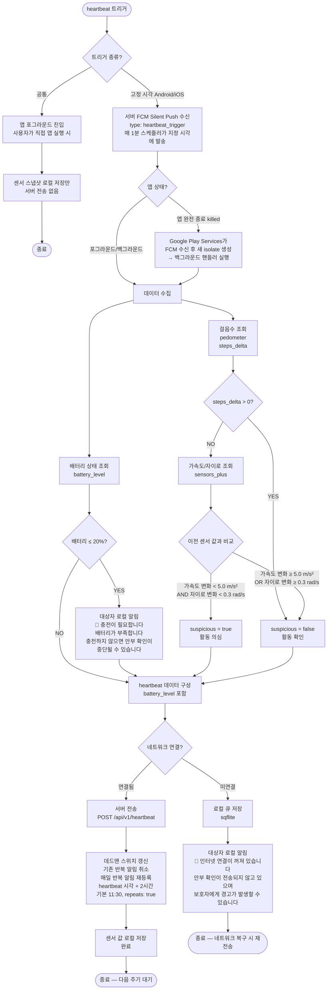
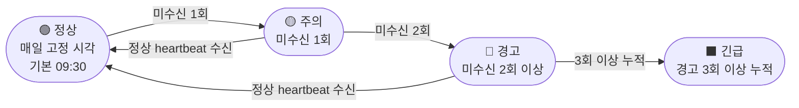
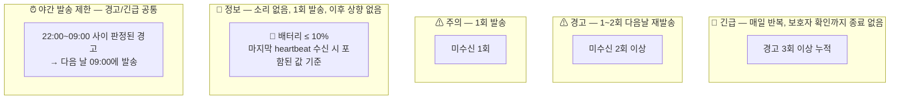
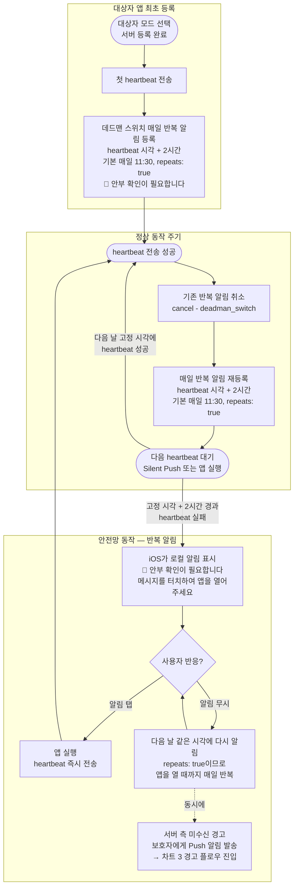

# Heartbeat 감지 및 경고 플로우차트

## 경고 등급 최종 확정 테이블

| 등급 | 조건 | 발송 |
|------|------|------|
| 🚨 긴급 | 경고 3회 이상 누적 | 매일 반복, 보호자 확인까지 종료 없음 |
| ⚠ 경고 | 미수신 2회 이상 | 1~2회 다음날 재발송 |
| ⚠ 주의 | 미수신 1회 | 1회 발송 |
| 🔵 정보 | 배터리 ≤ 10% (마지막 heartbeat 기준) | 1회 발송, 이후 상향 없음 |


## 용어 설명

| 용어 | 값 | 의미 |
|------|-----|------|
| `suspicious` | `true` | 센서 변화 없음 — 폰을 아무도 만지지 않은 것으로 의심되는 상태 |
| `suspicious` | `false` | 센서 변화 감지 — 누군가 폰을 사용한 정상 상태 |


## 1. 클라이언트 — Heartbeat 수집 및 전송




## 2. 서버 — Heartbeat 수신 후 판정

```mermaid
flowchart TD
    Receive([서버: heartbeat 수신])
    Receive --> UpdateLastSeen[last_seen 갱신]

    UpdateLastSeen --> TodayCheck{오늘(KST) 이미<br/>heartbeat 수신 여부?}
    TodayCheck -->|이미 수신 + suspicious=true| ForceNormal[suspicious 강제 false<br/>하루 첫 heartbeat에서만 판정]
    TodayCheck -->|첫 heartbeat| BattCheck

    ForceNormal --> BattCheck

    BattCheck{battery_level ≤ 10%?}
    BattCheck -->|YES| BattNoti[🔵 정보 등급<br/>보호자 Push 알림 소리 없음<br/>🔋 배터리 부족<br/>충전이 필요합니다]
    BattCheck -->|NO| AlertActive
    BattNoti --> AlertActive

    AlertActive{기존 경고 활성 중?}
    AlertActive -->|YES| SuspiciousFirst{suspicious?}

    SuspiciousFirst -->|false| Resolve[경고 완전 해소<br/>보호자 Push 알림<br/>✅ 대상자의 안부 확인이<br/>정상 복귀되었습니다]
    SuspiciousFirst -->|true| Downgrade[경고 등급 하향<br/>warning / urgent → caution<br/>정상 복귀 알림 없음<br/>폰 신호만 수신, 사용 흔적 없음]

    AlertActive -->|NO| CheckSuspicious{suspicious?}
    Resolve --> StatusNormal([✅ 정상<br/>센서 움직임 감지 — 사용 확인])
    Downgrade --> WellbeingCheck

    CheckSuspicious -->|false| StatusNormal
    CheckSuspicious -->|true| WellbeingCheck[대상자에게 wellbeing_check 발송<br/>📱 안부를 확인해 주세요<br/>보호자 경고 없음]
    WellbeingCheck --> Wait1([⏱ 다음 heartbeat 대기<br/>보호자 경고는 미수신 시에만 발생])
```


## 3. 서버 — Heartbeat 미수신 시 경고 플로우

```mermaid
flowchart TD
    Scheduler([서버 APScheduler: 매 분 정각 실행<br/>CronTrigger(second=0)<br/>① heartbeat_trigger FCM 발송 (지정 시각)<br/>② heartbeat 시각 + 2시간 경과 시 미수신 체크])
    Scheduler --> FindMissing[해당 시각까지<br/>heartbeat 미수신 대상자 조회]

    FindMissing --> SubActive{보호자<br/>구독 활성?}
    SubActive -->|NO| Skip([알림 미발송<br/>heartbeat는 계속 수신])
    SubActive -->|YES| CheckLastBatt{마지막 heartbeat의<br/>battery_level ≤ 10%?}

    CheckLastBatt -->|YES| BattDead[🔵 정보 등급 판정<br/>배터리 방전 추정]
    BattDead --> BattDeadNoti[보호자 Push 알림 정보 등급 소리 없음<br/>🔋 배터리 방전 추정<br/>충전 후 자동으로 정상 복귀됩니다]
    BattDeadNoti --> BattEnd([1회 발송 후 종료<br/>이후 미수신 지속되어도 상향 없음<br/>heartbeat 수신 시 자동 해소])

    CheckLastBatt -->|NO| MissCount{누적 미수신 횟수?}

    MissCount -->|1회| Caution[⚠ 주의 등급 판정]
    Caution --> CautionNoti[보호자 Push 알림 주의 등급<br/>⚠ 안부 확인<br/>오늘 안부 확인이 없습니다]
    CautionNoti --> NextDay0([다음 날 재확인])

    MissCount -->|2회 이상| Warning[⚠ 경고 등급 판정]
    Warning --> NightCheck1{현재 시각<br/>22:00~09:00?}

    NightCheck1 -->|NO 주간| WarningNoti[보호자 Push 알림 경고 등급<br/>⚠ 안부 확인<br/>안부 확인이 없습니다<br/>통신 불가 상태일 수 있습니다]
    NightCheck1 -->|YES 야간| Delay1([DB에 기록 후<br/>다음 날 09:00에 발송 예약])
    Delay1 --> WarningNoti

    WarningNoti --> WarningRepeat{경고 횟수?}
    WarningRepeat -->|2회 이하| NextDay1([다음 날 같은 시각에 재발송])
    WarningRepeat -->|3회 이상| UpgradeUrgent[🚨 긴급 등급으로 상향]
    UpgradeUrgent --> NightCheck2{현재 시각<br/>22:00~09:00?}

    NightCheck2 -->|NO 주간| UrgentNoti[보호자 Push 알림 긴급 등급<br/>🚨 긴급: 대상자 확인 필요<br/>즉시 확인이 필요합니다]
    NightCheck2 -->|YES 야간| Delay2([DB에 기록 후<br/>다음 날 09:00에 발송 예약])
    Delay2 --> UrgentNoti

    UrgentNoti --> DailyRepeat([매일 같은 시각에 반복<br/>보호자 확인까지 종료 없음])
```


## 4. 적응형 Heartbeat 주기 상태도




## 5. 경고 등급 요약




## 6. iOS 로컬 알림 데드맨 스위치 (Dead Man's Switch)

> BGTaskScheduler는 iOS가 실행 시점을 보장하지 않으며, 앱 강제 종료 시 동작하지 않으므로 채택하지 않는다.
> 대신 **로컬 알림 예약/취소 패턴**으로 iOS의 안전망을 구현한다.
> 로컬 알림은 예약 시간에 정확히 표시가 보장되며, 앱이 강제 종료되어도 정상 동작한다.



**데드맨 스위치가 발동하는 상황:**

| 상황 | Silent Push | 데드맨 스위치 반복 알림 | 결과 |
|------|-------------|----------------------|------|
| 정상 동작 (09:30) | 수신 → heartbeat 성공 | 매번 리셋되어 11:30 알림 표시 안 됨 | 정상 |
| 앱 강제 종료 (스와이프) | **미전달** (Apple 정책) | **당일 11:30 표시, 이후 매일 11:30 반복** | 사용자가 탭하면 복구 |
| 네트워크 장시간 불가 | 미수신 (네트워크 없음) | **당일 11:30 표시, 이후 매일 11:30 반복** | 네트워크 복구 + 앱 실행 시 복구 |
| 백그라운드 앱 새로고침 OFF | 영향 없음 (Silent Push는 별도) | **당일 11:30 표시, 이후 매일 11:30 반복** | 사용자가 탭하면 복구 |
| 알림 권한 거부 | 영향 없음 | **표시 불가** | 서버 경고로만 대응 |

※ 위 시각은 기본값(09:30) 기준. 보호자가 시각을 변경하면 데드맨 알림도 자동 조정됨.


## Mermaid 렌더링 방법

- **VS Code**: [Markdown Preview Mermaid Support](https://marketplace.visualstudio.com/items?itemName=bierner.markdown-mermaid) 확장 프로그램 설치 → `Ctrl+Shift+V`로 미리보기
- **GitHub**: push하면 자동 렌더링
- **웹**: [Mermaid Live Editor](https://mermaid.live/)에 코드 붙여넣기
